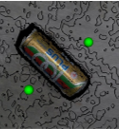
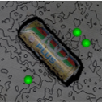
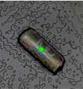
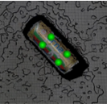

# Easy Manipulation Deployment 

 

### This ROS2 package provides a modular and easy to deploy manipulation pipeline that integrates perception elements to establish an end-to-end pick and place task
 

 

This package was tested with the [easy_perception_deployment](https://github.com/ros-industrial/easy_perception_deployment) ROS2 package, but any other perception system that provides the same ROS2 message in the right topic can work with this package as well. 

It is recommended to run this package on **ROS2 Foxy**.

---
## Full Documentation/Wiki

[Check out the Full Documentation here](https://easy-manipulation-deployment-docs.readthedocs.io/)

[Check out the API Documentation here](https://tanjpg.github.io/emd_docs/html/index.html)

---
## Components

### 1) Grasp Planner

An algorithmic based grasp planner that plans grasps in 3D space. Highly configurable and currently supports multifinger parallel grippers and suction cup arrays.

Two Finger Gripper

 

Three Finger Gripper

 

Single Suction Cup

 

2x2 Suction Array

 

### 2) Grasp Execution

A Moveit2 Based Grasp Execution package that incorporates real time dynamic safety components

### 3) Workcell Builder

A GUI based solution for ease of generation of robotic workcell simulations

---
## Acknowledgements

We would like to acknowledge the Singapore government for their vision and support to start this ambitious research and development project, "Accelerating Open Source Technologies for Cross Domain Adoption through the Robot Operating System". The project is supported by Singapore National Robotics Programme (NRP).

Any opinions, findings and conclusions or recommendations expressed in this material are those of the author(s) and do not reflect the views of the NR2PO.

