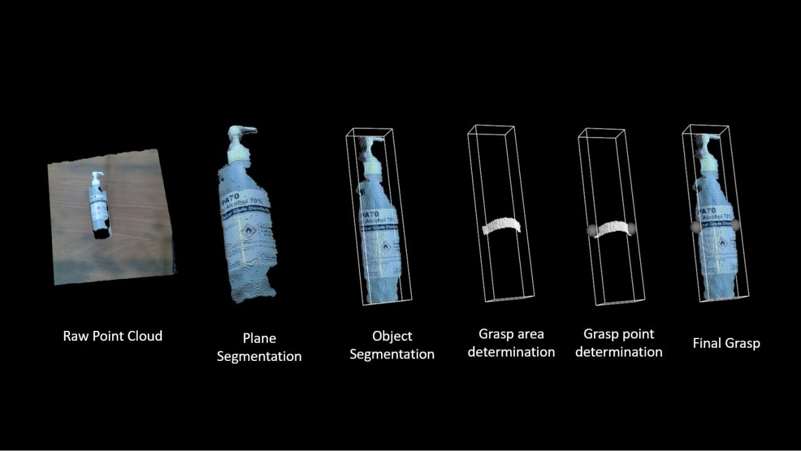
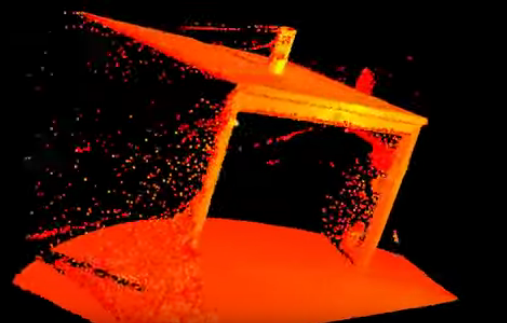
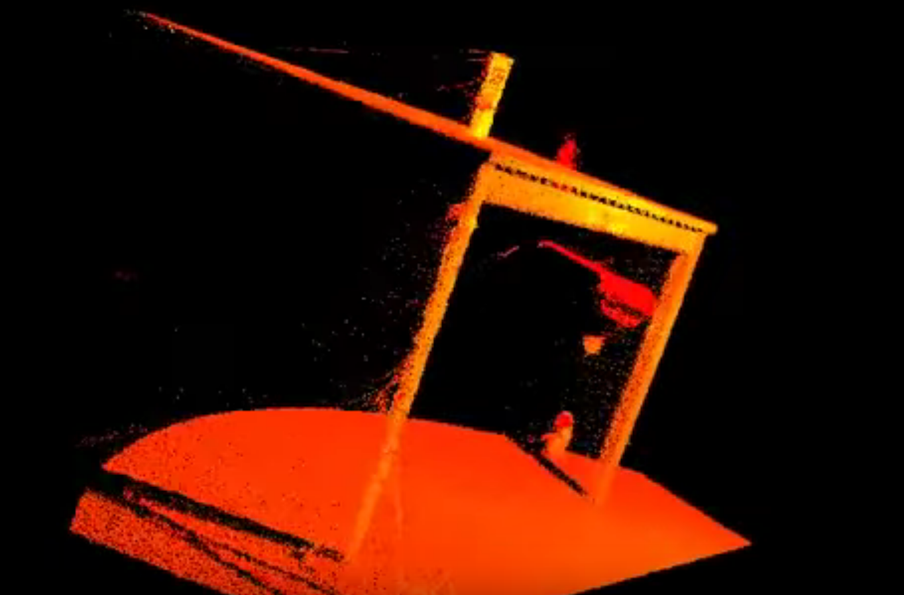

.. easy_manipulation_deployment documentation master file, created by
   sphinx-quickstart on Thu Oct 22 11:03:35 2020.
   You can adapt this file completely to your liking, but it should at least
   contain the root `toctree` directive.

.. _grasp_planner:

Grasp Planner
========================================================

.. rubric:: Methodology

The methodology for the grasp planner can be broken down into several steps.

.. rubric:: 1) Point Cloud filtering
.. rubric:: 2) Plane Segmentation
.. rubric:: 3) Object Segmentation
.. rubric:: 4) Grasp Area determination
.. rubric:: 5) Grasp point determination
.. rubric:: 6) Grasp Ranking
.. rubric:: 7) Best Final Grasp

.. rubric:: 1) Point Cloud filtering

Raw pointclouds generally include areas that are unnecessary and include alot of noise. Therefore, the user given the option to filter to an area of 
the raw pointcloud that they may want to focus on. This is shown later in the :ref:`Grasp Planner Configuration page <grasp_planner_configuration>`   
  
Once the desired area of the pointcloud is specified, noise within specified pointcloud is then removed. This is done through a 
`StatisticalOutlierRemoval filter<https://pcl.readthedocs.io/en/latest/statistical_outlier.html>`__

+-----------------------+---------------------+
| Before Noise Removal  | After Noise Removal |
+=======================+=====================+
||Before_statis|        ||After_statis|       |
+-----------------------+---------------------+

.. rubric:: 2) Plane Segmentation

.. rubric:: 3) Object Segmentation

Every individual object within the filtered pointcloud is segmented and the grasp planner does planning for each object.

.. rubric:: 4) Grasp Area determination

Area of which the planner will take into account for determining grasp points depending on the number of fingers/number of suction cups

.. rubric:: 5) Grasp point determination

Exact points of where the middle of the finger/suction cup should be for that specific grasp

.. rubric:: 6) Grasp Ranking

There are many possibe grasping configurations that the grasp planner has taken into account. The quality of those grasps are then ranked based of a metric.
The metrics of the individual end-effector types can be found on their respective pages
  
:ref:`Finger Grasps <grasp_planner_finger>` and :ref:`Suction Grasps <grasp_planner_suction>`
   
.. rubric:: 7) Best Final Grasp

The pose of the top ranked grasp is then published for :ref:`Grasp Execution <grasp_execution_demo>`

.. toctree::
   :maxdepth: 2
   
   grasp_planner_before
   grasp_planner_run

