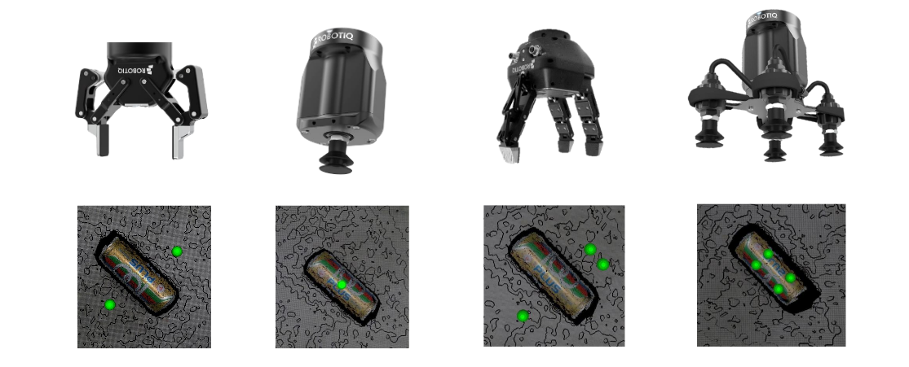

.. easy_manipulation_deployment documentation master file, created by
   sphinx-quickstart on Thu Oct 22 11:03:35 2020.
   You can adapt this file completely to your liking, but it should at least
   contain the root `toctree` directive.

.. _grasp_planner:

Grasp Planner
========================================================
Overview
^^^^^^^^^^^^^^^^^^^^^^^^^^^^^^^^^

The Easy Manipulation Deployment Grasp Planner is an Algorithmic Based Point Cloud Grasp Planner that provides a 4 DOF Grasp Pose for
both Multi-finger End Effectors and Suction Array End Effectors.

Benefits of EMD Grasp Planner
---------------------------------------------------------------------

The Grasp Planner aims to **eliminate** the following issues that users would face when deploying Machine Learning based Grasp Planners:

**1. Long training times and tedious Dataset acquisition and labelling**

Current datasets available such as the `Cornell Grasping Dataset <https://www.cs.cornell.edu/home/llee/data/>`_ and `Jacquard Grasping Dataset <https://jacquard.liris.cnrs.fr/>`_ generally account for two finger grippers and is training on general objects.
For custom use cases, datasets need to be generated and hand labeled which requires huge amount of time and manual labor. Semantic description of multi-finger grippers and suction arrays may be hard to determine as well.

The Grasp Planner presented in this ROS2 package requires zero datasets and training, and supports multi-fingered parallel grippers as well as suction cup arrays.

**2. Lack of On-The-Fly End Effector Switching**

In high mix, low volume pick-and-place scenarios, different end effectors may be needed for different types of objects. Changing of end effectors would then mean that the user would need to collect a
whole new dataset, relabel and retrain the dataset and models before use.

The Grasp Planner presented in this ROS2 package allows for on-the-fly end effector switching through a simple configuration file that is highly customized and understandable.

Before running the Grasp Planner
^^^^^^^^^^^^^^^^^^^^^^^^^^^^^^^^^
Recommended information to read before running the Grasp Planner

.. toctree::
   :maxdepth: 2

   grasp_planner_theory
   grasp_planner_parameters

Running the Grasp Planner
^^^^^^^^^^^^^^^^^^^^^^^^^^^^^^^^^
.. toctree::
   :maxdepth: 2

   grasp_planner_run

Useful information
^^^^^^^^^^^^^^^^^^^^^
Information that you may need for further customization of the package.

.. toctree::
   :maxdepth: 2

   grasp_planner_input
   grasp_planner_output

Acknowledgements
^^^^^^^^^^^^^^^^^^^^^^^^^^^^^^^^^
Initial inspiration for grasp planning algorithm was provided by the following paper, and have been repurposed to support multiple fingers as well as suction cup arrays

`Fast Geometry-based Computation of Grasping Points on Three-dimensional Point Clouds <https://www.researchgate.net/publication/331358070_Fast_Geometry-based_Computation_of_Grasping_Points_on_Three-dimensional_Point_Clouds>`_

