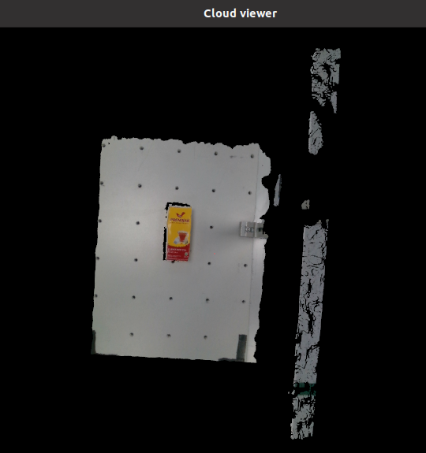
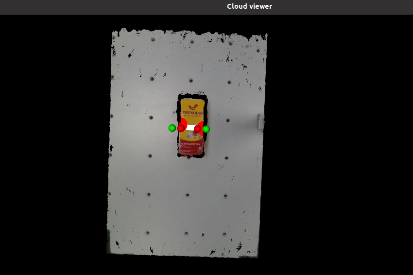
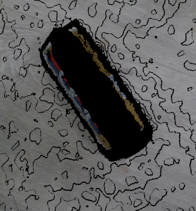

.. easy_manipulation_deployment documentation master file, created by
   sphinx-quickstart on Thu Oct 22 11:03:35 2020.
   You can adapt this file completely to your liking, but it should at least
   contain the root `toctree` directive.

.. _grasp_planner_configuration:

Grasp Planner Configuration
========================================================

In order for the grasp planner to plan the right type of grasp, we need to first create a configuration file in the config folder , ``params.yaml``. 

This file can be located in ``grasp_planner/example/config/params.yaml``

.. note:: It is advised to write over the current `params.yaml` file to prevent any YAML parsing errors. The params.yaml file can be renamed and
          and saved as a specific configuration as a preloaded configuration file for a specific end effector.

          Example: `params_2f.yaml`

- Grasp Planner package currently identifies End Effectors as either ``Suction`` or ``Finger`` types. However both ``param.yaml`` files require pointcloud
  parameters. Therefore this section of the configuration can be used for both types of ``param.yaml`` files.

  .. image:: ../../images/grasp_planner/pointcloud_params_only.png

+----------------------------------------------------------------------------------+---------------------------------------------------------------------------------------------------------+
|                                     Parameter                                    |                                    Description                                                          |
+==================================================================================+=========================================================================================================+
|                            perception_topic                                      |                                Topic name of camera                                                     |
+----------------------------------------------------------------------------------+---------------------------------------------------------------------------------------------------------+
|                                    camera_frame                                  |                           Reference frame the camera uses                                               |
+----------------------------------------------------------------------------------+---------------------------------------------------------------------------------------------------------+
|                             passthrough_filter_limits_x                          |            Upper and lower limits for passthrough filtering in the x axis                               |
+----------------------------------------------------------------------------------+---------------------------------------------------------------------------------------------------------+
|                             passthrough_filter_limits_y                          |            Upper and lower limits for passthrough filtering in the y axis                               |
+----------------------------------------------------------------------------------+---------------------------------------------------------------------------------------------------------+
|                             passthrough_filter_limits_z                          |            Upper and lower limits for passthrough filtering in the z axis                               |
+----------------------------------------------------------------------------------+---------------------------------------------------------------------------------------------------------+
|                         segmentation_max_iterations (For plane segmentation)     |          Maximum number of iterations before giving up                                                  |
+----------------------------------------------------------------------------------+---------------------------------------------------------------------------------------------------------+
|                          segmentation_distance_threshold (For plane segmentation)|   Determines how close a point must be to the model in order to be considered an inlier                 |
+----------------------------------------------------------------------------------+---------------------------------------------------------------------------------------------------------+
|          cluster_tolerance (For Normals estimation)                              |                                                                                                         |
+----------------------------------------------------------------------------------+---------------------------------------------------------------------------------------------------------+
|          min_cluster_size (For Euclidean cluster extraction)                     | Determine the minimum number of points to be considered a cluster                                       |
+----------------------------------------------------------------------------------+---------------------------------------------------------------------------------------------------------+
|          cloud_normal_radius (For Normals estimation)                            | Determine the radius around which the planner estimates the local surface properties at each point.     |
+----------------------------------------------------------------------------------+---------------------------------------------------------------------------------------------------------+

.. rubric:: ``passthrough_filter_limits (x, y. z)``

- Upper and lower limits for passthrough filtering for respective x, y, z axis 
  
Pointclouds from the camera may include several objects or difference in terrain that is not required to be part of the pointcloud processing. 
This is shown in the images below.

+------------------------------+------------------------------+
| Pointcloud before filtering  | Pointcloud after filtering   |
+==============================+==============================+
|     |image_before_filter|    |     |image_after_filter|     |
+------------------------------+------------------------------+

If you set the range limits too big, you may cut out parts of the point cloud that may be important. If you set the limits too small, processing time may increase.

Therefore ``passthrough_filter_limits_(_)`` parameters should be adjusted depending to your environment

.. rubric:: ``segmentation_max_iterations`` & ``segmentation_distance_threshold``

.. rubric:: segmentation_max_iterations

- Maximum number of iterations before giving up

The higher you set, the slower the path planning times, but the higher the chance of better quality plane segmentation

.. rubric:: ``segmentation_distance_threshold``

- Determines how close a point must be to the model in order to be considered an inlier
  
A higher number ensures that more points will be clustered with the object cluster, but you run the risk of including points on the table as part of the object

A lower number ensures that only objects really close to the cluster is included inside, but you may run the risk of missing out some points on the surface

.. note:: The formula for each end-effector type is different, do select the correct end-effector type for your use case.

Proceed to either :ref:`grasp_planner_finger` or :ref:`grasp_planner_suction` to complete the rest of configuration .

.. toctree::
   :maxdepth: 1

   grasp_planner_finger
   grasp_planner_suction