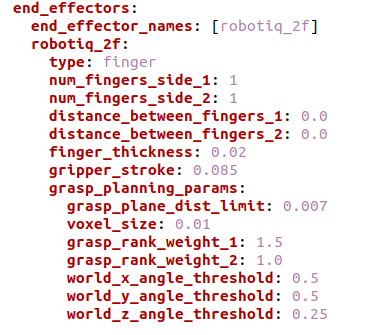
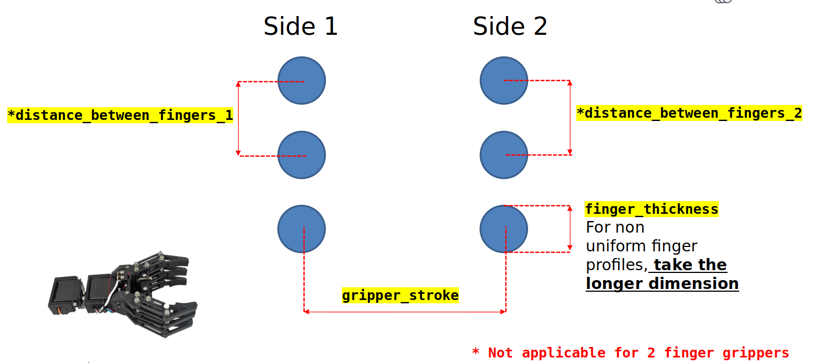
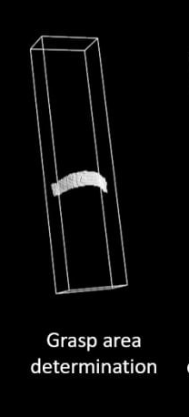
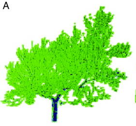
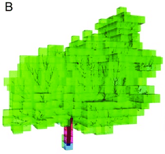
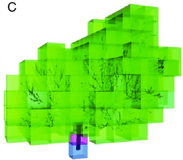
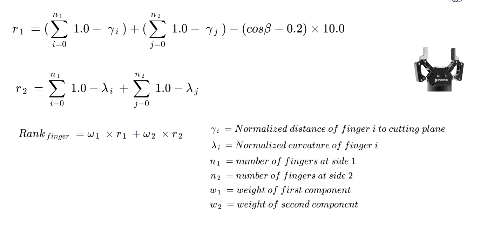

.. _grasp_planner_finger:

Finger Gripper
==============

The parameters for Finger Gripper end effectors are as follows:

+---------------------------+-------------------------------------------------------------------+
| Parameter                 |   Description                                                     |
+===========================+===================================================================+
| end_effector_names        |   Name of end effector                                            |
+---------------------------+-------------------------------------------------------------------+
| *Replace ``robotiq_2f`` with Name of end_effector*                                            |
+---------------------------+-------------------------------------------------------------------+
| type                      |   finger                                                          |
+---------------------------+-------------------------------------------------------------------+
| num_fingers_side_1        |   Number of fingers on left side (Shown in Figure 1)              |
+---------------------------+-------------------------------------------------------------------+
| num_fingers_side_2        |   Number of fingers on right side (Shown in Figure 1)             |
+---------------------------+-------------------------------------------------------------------+
| distance_between_fingers_1|   Distance between each finger on left side (Shown in Figure 2)   |
+---------------------------+-------------------------------------------------------------------+
| distance_between_fingers_2|   Distance between each finger on right side (Shown in Figure 2)  |
+---------------------------+-------------------------------------------------------------------+
| finger_thickness          |   Thickness of a single finger (Shown in Figure 2)                |
+---------------------------+-------------------------------------------------------------------+
| gripper_stroke            |   Distance of between fingers on opposite ends (Shown in Figure 2)|
+---------------------------+-------------------------------------------------------------------+
| grasp_plane_dist_limit    |   Determine the thickness of the grasp area sampled.              |
+---------------------------+-------------------------------------------------------------------+
| voxel_size                |   Determine the leaf size during point cloud down sampling        |
+---------------------------+-------------------------------------------------------------------+
| grasp_rank_weight_1       |   Part of Grasp Planner Ranking formula (Default value)           |
+---------------------------+-------------------------------------------------------------------+
| grasp_rank_weight_2       |   Part of Grasp Planner Ranking formula (Default value)           |
+---------------------------+-------------------------------------------------------------------+
| world_x_angle_threshold   |   (Default value)                                                 |
+---------------------------+-------------------------------------------------------------------+
| world_y_angle_threshold   |   (Default value)                                                 |
+---------------------------+-------------------------------------------------------------------+
| world_z_angle_threshold   |   (Default value)                                                 |
+---------------------------+-------------------------------------------------------------------+

.. note:: The line right after ``end_effector_names`` requires you to input the name of the end_effector specified.

- Determining ``num_fingers_side_1`` and ``num_fingers_side_2`` parameters are shown in Figure 1 below.

.. |Figure_1| image:: ../../images/grasp_planner/finger_gripper_figure1.png
   :align: middle

+-----------+
| Figure 1  |
+===========+
||Figure_1| |
+-----------+

- Determining ``distance_between_fingers_1``, ``distance_between_fingers_2``, ``finger_thickness`` and ``gripper_stroke`` parameters are shown in Figure 2 below. 
  

+-----------+
| Figure 2  |
+===========+
||Figure_2| |
+-----------+

.. rubric:: ``grasp_plane_dist_limit``

- Determine the thickness of the grasp area sampled.

Smaller plane distance results  in less points considered during grasp planning, resulting in faster planning times, but possibly less accurate grasp plans

Larger plane distance results  in more points considered during grasp planning, resulting in lower planning times, but possibly more accurate grasp plans

.. rubric:: ``voxel_size``

-  Determine the leaf size during point cloud down sampling

Small voxel sizes means higher number of points after downsampling, resulting in slower grasp planning time, but possible more accurate grasp plans

Large voxel sizes means smaller number of points after downsampling, which may result faster planning time, but lower accuracy of grasp plans due to the lack of points

  

+---------------------------------------------------------+
|                    Voxel Sizes                          |
+----------------+----------------------+-----------------+
|     Small      |        Medium        |      Large      |
+================+======================+=================+
|   |Voxel_A|    |      |Voxel_B|       |    |Voxel_C|    |
+----------------+----------------------+-----------------+

Grasp Planning Metric    (Finger)
=======================================

- Every possible grasps on the object are ranked by utlizing this formula. The position and orientation of the best quality grasp is then published for ref::`grasp_execution_demo`. 

