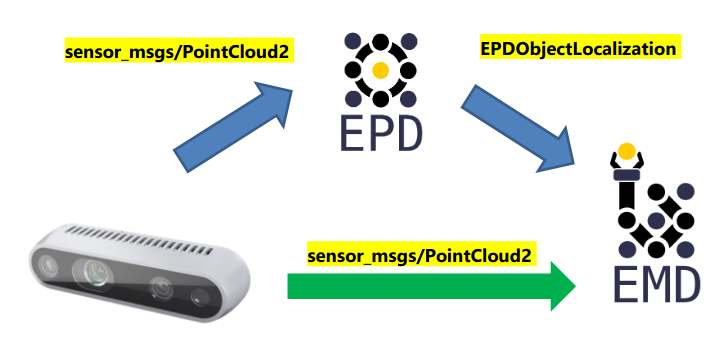

.. easy_manipulation_deployment documentation master file, created by
   sphinx-quickstart on Thu Oct 22 11:03:35 2020.
   You can adapt this file completely to your liking, but it should at least
   contain the root `toctree` directive.

.. _grasp_planner_input:

Grasp Planner Input Message Types
==================================

For a grasp planner, a perception system will provide the necessary inputs required to plan grasps. Currently there are two main workflows for the grasp planner:

You can choose which workflow you want to use via the configuration file at :ref:`grasp_planner_parameters_general_epd`

Direct Camera Input
---------------------

The EMD Grasp Planner can receive a `PointCloud2 <http://docs.ros.org/en/melodic/api/sensor_msgs/html/msg/PointCloud2.html/>`_ 
message type  as input into the system. This is a commonly used message type for many cameras to send point clouds. The purpose 
of supporting this Input time is to provide a flexible option for users to choose the input type based on their needs and 
hardware specifications

EPD Input
---------------------
The EMD Grasp Planner also supports output from the `easy_perception_deployment <https://github.com/ros-industrial/easy_perception_deployment/>`_

Currently the EMD Grasp Planner supports both **Object Localization** and **Object Tracking** outputs from EPD Precision level 3.

To understand more about the output messages from EPD, do visit the `EPD documentation <https://easy-perception-deployment.readthedocs.io/en/latest/>`_

Which EMD Workflow to choose?
-------------------------------

1. Do you need to pick up all the objects in the area, or only specific ones/in a specific order?
^^^^^^^^^^^^^^^^^^^^^^^^^^^^^^^^^^^^^^^^^^^^^^^^^^^^^^^^^^^^^^^^^^^^^^^^^^^^^^^^^^^^^^^^^^^^^^^^^^^

All the objects in the area: Direct Camera Workflow
~~~~~~~~~~~~~~~~~~~~~~~~~~~~~~~~~~~~~~~~~~~~~~~~~~~~

For the Direct Camera Workflow, as objects are determined through pointcloud processing rather than using deep learning methods of identification,
even objects that may be typically hard for deep learning methods to detect can be detected through raw point clouds. As long as the camera can
generate the point cloud, grasps can be planned for that object.

Specific Objects/ Specific Order: EPD Workflow
~~~~~~~~~~~~~~~~~~~~~~~~~~~~~~~~~~~~~~~~~~~~~~~~~~~~~~~~~~~

For the EPD workflow, the grasp area is first processed with a deep learning model, thus Object identity of each object as well as the location is known,
thus users can determine which object should be picked, or which object should be picked first. 

.. note:: Currently, EMD does not allow object prioritization as of now, but the EPD workflow is definitely the workflow required
            for this feature.

2. Preparation time before pipeline execution
^^^^^^^^^^^^^^^^^^^^^^^^^^^^^^^^^^^^^^^^^^^^^^^

Less time required: Direct Camera Workflow
~~~~~~~~~~~~~~~~~~~~~~~~~~~~~~~~~~~~~~~~~~~~~~~~~~~~~~~~~~~

For the Direct Camera Workflow, Zero training is needed, as no deep learning components are used. Thus no datasets of the objects is needed
before running the whole pipeline. The only preprocessing step required is writing the configuration yaml file for the grasp
planner: :ref:`grasp_planner_parameters` 

More time required: EPD Workflow
~~~~~~~~~~~~~~~~~~~~~~~~~~~~~~~~~~~~~~~~~~~~~~~~~~~~~~~~~~~

As there is a deep learning component for the EPD workflow, labelled datasets for grasping objects is required to train the perception system,
which may take some time to prepare especially if the user requires idenfication of larger number of objects.

3. Hardware requirements
^^^^^^^^^^^^^^^^^^^^^^^^^^^^^^^^^^^^^^^^^^^^^^^

Lower hardware requriements: Direct Camera Workflow
~~~~~~~~~~~~~~~~~~~~~~~~~~~~~~~~~~~~~~~~~~~~~~~~~~~~~~~~~~~

Without the need for Deep learning, the pick and place pipeline can generally run relatively well with CPU, and can be enhanced with GPU usage,

Greater hardware requriements: EPD Workflow
~~~~~~~~~~~~~~~~~~~~~~~~~~~~~~~~~~~~~~~~~~~~~~~~~~~~~~~~~~~

Due to the higher hardware limitations for deploying of deep learning models, hardware requirements will be higher for the EPD workflow.
Check the `easy_perception_deployment documentation <https://easy-perception-deployment.readthedocs.io/en/latest/>`_
for a more comprehensive hardware requirement specifications.

Which EMD Workflow to choose (TLDR)?
----------------------------------------
In summary, at a quick glance this would be how you could choose your workflow for your use case.

+-----------------------+------------------------+-----------------------+
|      Requirements     |           EPD          |        Camera         |
+=======================+========================+=======================+
| Picking requirements: | Specific objects/order | All Objects/ No Order |
+-----------------------+------------------------+-----------------------+
| Preparation time:     |          Slower        |          Faster       |
+-----------------------+------------------------+-----------------------+
| Hardware requirements:|          Higher        |          Lower        |
+-----------------------+------------------------+-----------------------+

