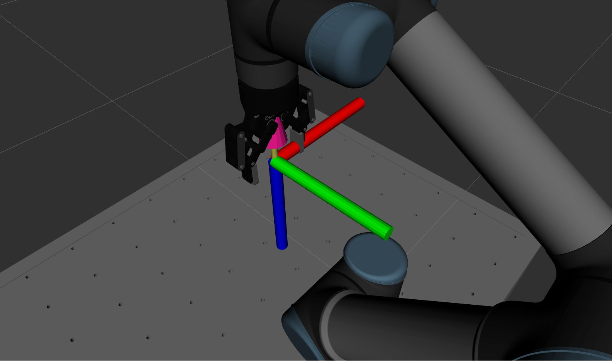

.. easy_manipulation_deployment documentation master file, created by
   sphinx-quickstart on Thu Oct 22 11:03:35 2020.
   You can adapt this file completely to your liking, but it should at least
   contain the root `toctree` directive.

.. _grasp_planner_parameters_finger_axis:

Grasp Planner Finger Parameters (Coordinate Systems)
========================================================

The parameters in this section provides user the flexibility to define the coordinate system
definition for their gripper. 

For :code:`grasp_approach_direction` axis, it is defined as the direction along which the end effector will travel
to approach the object to grasp it.

For the :code:`grasp_stroke_direction` axis, it is defined as the direction from one side of the finger gripper to another,
i.e the direction of movement when the finger gripper closes

For the :code:`grasp_stroke_normal_direction` axis, is defined as the direction perpendicular to both
:code:`grasp_stroke_direction` and :code:`grasp_approach_direction`.

For this particular configuration below, assuming the RGB-XYZ convention, the coordinate system is defined as the following:

.. code-block:: bash

   gripper_coordinate_system:
     grasp_stroke_direction: "x"
     grasp_stroke_normal_direction: "y"
     grasp_approach_direction: "z"

<finger_gripper_name>.gripper_coordinate_system.grasp_stroke_direction
^^^^^^^^^^^^^^^^^^^^^^^^^^^^^^^^^^^^^^^^^^^^^^^^^^^^^^^^^^^^^^^^^^^^^^^^

.. code-block:: bash

   length_direction: "x"

.. list-table::
   :widths: 5 20
   :header-rows: 0
   :stub-columns: 1

   * - Description
     - Axes defining the grasp stroke direction
   * - Type
     - String

.. warning:: Restricted to :code:`"x"` , :code:`"y"` or :code:`"z"`

<finger_gripper_name>.gripper_coordinate_system.grasp_stroke_normal_direction
^^^^^^^^^^^^^^^^^^^^^^^^^^^^^^^^^^^^^^^^^^^^^^^^^^^^^^^^^^^^^^^^^^^^^^^^^^^^^^^

.. code-block:: bash

   breadth_direction: "y"

.. list-table::
   :widths: 5 20
   :header-rows: 0
   :stub-columns: 1

   * - Description
     - Axes defining the grasp stroke normal direction
   * - Type
     - String

.. warning:: Restricted to :code:`"x"` , :code:`"y"` or :code:`"z"`

<finger_gripper_name>.gripper_coordinate_system.grasp_approach_direction
^^^^^^^^^^^^^^^^^^^^^^^^^^^^^^^^^^^^^^^^^^^^^^^^^^^^^^^^^^^^^^^^^^^^^^^^^^^^

.. code-block:: bash

   grasp_approach_direction: "z"

.. list-table::
   :widths: 5 20
   :header-rows: 0
   :stub-columns: 1

   * - Description
     - Axes defining the grasp approach direction
   * - Type
     - String

.. warning:: Restricted to :code:`"x"` , :code:`"y"` or :code:`"z"`