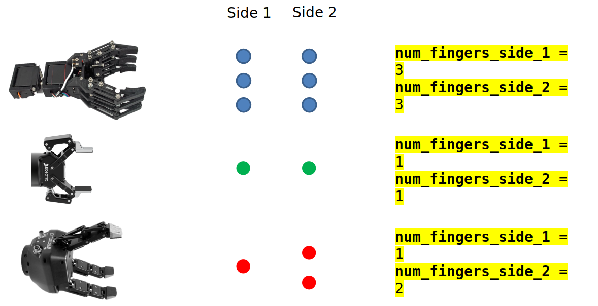

.. easy_manipulation_deployment documentation master file, created by
   sphinx-quickstart on Thu Oct 22 11:03:35 2020.
   You can adapt this file completely to your liking, but it should at least
   contain the root `toctree` directive.

.. _grasp_planner_parameters_finger_physical:

Grasp Planner Finger Parameters (Physical Attributes)
========================================================

The Parameters in this Section specifically defines the physical attributes of the finger gripper.
These parameters provide additional flexibility for grasp planner to support a myriad of finger grippers.

The current grasp planner supports **linear finger grippers**, Where there are two main sides containing
the fingers, and grasping motions are parallel to the direction of distribution of fingers

.. code-block:: bash

     finger_gripper_1:
       type: finger
       num_fingers_side_1: 1
       num_fingers_side_2: 1
       distance_between_fingers_1: 0.0
       distance_between_fingers_2: 0.0
       finger_thickness: 0.02
       gripper_stroke: 0.105

.. image:: ../../images/grasp_planner/finger_param_physical2.png
   :align: center

<finger_gripper_name>.type
^^^^^^^^^^^^^^^^^^^^^^^^^^^^^

.. code-block:: bash

   type: finger

.. list-table::
   :widths: 5 20
   :header-rows: 0
   :stub-columns: 1

   * - Description
     - Describes gripper type
   * - Type
     - String

.. warning:: Do not change this parameter, leave it as :code:`finger`

<finger_gripper_name>.num_fingers_side_1
^^^^^^^^^^^^^^^^^^^^^^^^^^^^^^^^^^^^^^^^^^^^^^^^^

.. code-block:: bash

   num_cups_length: 1

.. list-table::
   :widths: 5 20
   :header-rows: 0
   :stub-columns: 1

   * - Description
     - Number of fingers on side 1
   * - Type
     - Int

.. warning:: Should be at least 1

<finger_gripper_name>.num_fingers_side_2
^^^^^^^^^^^^^^^^^^^^^^^^^^^^^^^^^^^^^^^^^^^^^^^^^

.. code-block:: bash

   num_cups_breadth: 1

.. list-table::
   :widths: 5 20
   :header-rows: 0
   :stub-columns: 1

   * - Description
     - Number of fingers on side 2
   * - Type
     - Int

.. warning:: Should be at least 1

<finger_gripper_name>.distance_between_fingers_1
^^^^^^^^^^^^^^^^^^^^^^^^^^^^^^^^^^^^^^^^^^^^^^^^^

.. code-block:: bash

   distance_between_fingers_1: 0.0

.. list-table::
   :widths: 5 20
   :header-rows: 0
   :stub-columns: 1

   * - Description
     - Center-to-center finger distance between fingers in side 1
   * - Type
     - Double

.. warning:: If :code:`num_fingers_side_1` is :code:`1`, set :code:`distance_between_fingers_1` as :code:`0.0`

<finger_gripper_name>.distance_between_fingers_2
^^^^^^^^^^^^^^^^^^^^^^^^^^^^^^^^^^^^^^^^^^^^^^^^^

.. code-block:: bash

   distance_between_fingers_2: 0.0

.. list-table::
   :widths: 5 20
   :header-rows: 0
   :stub-columns: 1

   * - Description
     - Center-to-center finger distance between fingers in side 2
   * - Type
     - Double

.. warning:: If :code:`num_fingers_side_2` is :code:`1`, set :code:`distance_between_fingers_2` as :code:`0.0`

<finger_gripper_name>.finger_thickness
^^^^^^^^^^^^^^^^^^^^^^^^^^^^^^^^^^^^^^^^^^^^^^^^^

.. code-block:: bash

   finger_thickness: 0.02

.. list-table::
   :widths: 5 20
   :header-rows: 0
   :stub-columns: 1

   * - Description
     - Maximum dimension of the finger (dimensions along the axis perpendicular to the approach direction)
   * - Type
     - Double

.. note:: We represent each finger as a sphere, which only requires one dimension, hence the largest dimension of the finger should be provided

<finger_gripper_name>.gripper_stroke
^^^^^^^^^^^^^^^^^^^^^^^^^^^^^^^^^^^^^^^^^^^^^^^^^

.. code-block:: bash

   gripper_stroke: 0.105

.. list-table::
   :widths: 5 20
   :header-rows: 0
   :stub-columns: 1

   * - Description
     - Distance between both sides of the finger gripper
   * - Type
     - Double
