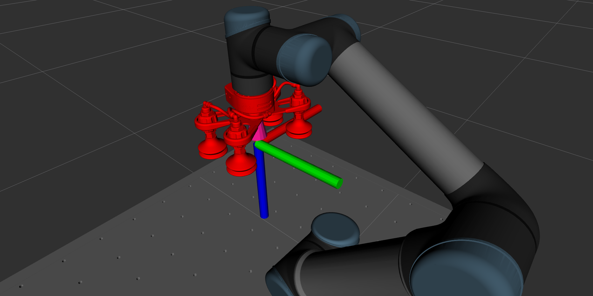

.. easy_manipulation_deployment documentation master file, created by
   sphinx-quickstart on Thu Oct 22 11:03:35 2020.
   You can adapt this file completely to your liking, but it should at least
   contain the root `toctree` directive.

.. _grasp_planner_parameters_suction_axis:

Grasp Planner Suction Parameters (Coordinate Systems)
========================================================

The parameters in this section provides user the flexibility to define the coordinate system
definition for their gripper. 

For :code:`grasp_approach_direction` axis, it is defined as the direction along which the end effector will travel
to approach the object to grasp it.

For the :code:`length_direction` and :code:`breadth_direction`, these are the perpendicular axes along which the suction 
cups are arranged. Which direction is length and breadth can be arbitrarily defined, but should be 
consistent with the definition for the parameters in :ref:`grasp_planner_parameters_suction_physical`

For this particular configuration below, assuming the RGB-XYZ convention, the coordinate system is defined as the following:

.. code-block:: bash

   gripper_coordinate_system:
     length_direction: "x"
     breadth_direction: "y"
     grasp_approach_direction: "z"

<suction_gripper_name>.gripper_coordinate_system.length_direction
^^^^^^^^^^^^^^^^^^^^^^^^^^^^^^^^^^^^^^^^^^^^^^^^^^^^^^^^^^^^^^^^^^^^

.. code-block:: bash

   length_direction: "x"

.. list-table::
   :widths: 5 20
   :header-rows: 0
   :stub-columns: 1

   * - Description
     - Axes defining the length direction
   * - Type
     - String

.. warning:: Restricted to :code:`"x"` , :code:`"y"` or :code:`"z"`

<suction_gripper_name>.gripper_coordinate_system.breadth_direction
^^^^^^^^^^^^^^^^^^^^^^^^^^^^^^^^^^^^^^^^^^^^^^^^^^^^^^^^^^^^^^^^^^^

.. code-block:: bash

   breadth_direction: "y"

.. list-table::
   :widths: 5 20
   :header-rows: 0
   :stub-columns: 1

   * - Description
     - Axes defining the breadth direction
   * - Type
     - String

.. warning:: Restricted to :code:`"x"` , :code:`"y"` or :code:`"z"`

<suction_gripper_name>.gripper_coordinate_system.grasp_approach_direction
^^^^^^^^^^^^^^^^^^^^^^^^^^^^^^^^^^^^^^^^^^^^^^^^^^^^^^^^^^^^^^^^^^^^^^^^^^^^

.. code-block:: bash

   grasp_approach_direction: "z"

.. list-table::
   :widths: 5 20
   :header-rows: 0
   :stub-columns: 1

   * - Description
     - Axes defining the grasp approach direction
   * - Type
     - String

.. warning:: Restricted to :code:`"x"` , :code:`"y"` or :code:`"z"`