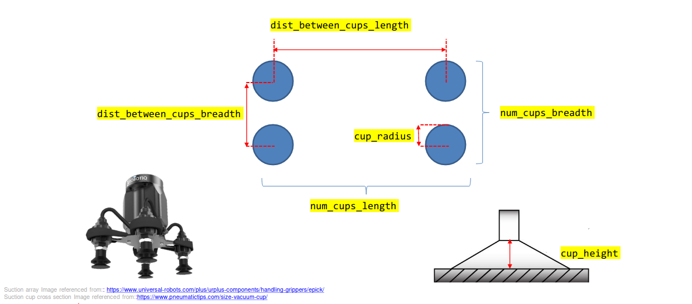

.. easy_manipulation_deployment documentation master file, created by
   sphinx-quickstart on Thu Oct 22 11:03:35 2020.
   You can adapt this file completely to your liking, but it should at least
   contain the root `toctree` directive.

.. _grasp_planner_parameters_suction_physical:

Grasp Planner Suction Parameters (Physical Attributes)
========================================================

The Parameters in this Section specifically defines the physical attributes of the suction gripper.
These parameters provide additional flexibility for grasp planner to support a myriad of suction grippers.

.. code-block:: bash

     suction_gripper_1:
       type: suction
       num_cups_length: 1
       num_cups_breadth: 1
       dist_between_cups_length: 0.06
       dist_between_cups_breadth: 0.06
       cup_radius: 0.005
       cup_height: 0.01

.. note:: "Length" and "Breadth" elements can be determined by the user, as long as it remains consistent for
          the whole file

<suction_gripper_name>.type
^^^^^^^^^^^^^^^^^^^^^^^^^^^^^^^^^^^^^^^^^^^^^^^^^

.. code-block:: bash

   type: suction

.. list-table::
   :widths: 5 20
   :header-rows: 0
   :stub-columns: 1

   * - Description
     - Describes gripper type
   * - Type
     - String

.. warning:: Do not change this parameter, leave it as :code:`suction`

<suction_gripper_name>.num_cups_length
^^^^^^^^^^^^^^^^^^^^^^^^^^^^^^^^^^^^^^^^^^^^^^^^^

.. code-block:: bash

   num_cups_length: 1

.. list-table::
   :widths: 5 20
   :header-rows: 0
   :stub-columns: 1

   * - Description
     - Number of cups in the length direction
   * - Type
     - Int

.. warning:: Should be at least 1

<suction_gripper_name>.num_cups_breadth
^^^^^^^^^^^^^^^^^^^^^^^^^^^^^^^^^^^^^^^^^^^^^^^^^

.. code-block:: bash

   num_cups_breadth: 1

.. list-table::
   :widths: 5 20
   :header-rows: 0
   :stub-columns: 1

   * - Description
     - Number of cups in the breadth direction
   * - Type
     - Int

.. warning:: Should be at least 1

<suction_gripper_name>.dist_between_cups_length
^^^^^^^^^^^^^^^^^^^^^^^^^^^^^^^^^^^^^^^^^^^^^^^^^

.. code-block:: bash

   dist_between_cups_length

.. list-table::
   :widths: 5 20
   :header-rows: 0
   :stub-columns: 1

   * - Description
     - Center-to-center distance between in the length direction (m)
   * - Type
     - Double

<suction_gripper_name>.dist_between_cups_breadth
^^^^^^^^^^^^^^^^^^^^^^^^^^^^^^^^^^^^^^^^^^^^^^^^^

.. code-block:: bash

   dist_between_cups_breadth

.. list-table::
   :widths: 5 20
   :header-rows: 0
   :stub-columns: 1

   * - Description
     - Center-to-center distance between in the breadth direction (m)
   * - Type
     - Double

<suction_gripper_name>.cup_radius
^^^^^^^^^^^^^^^^^^^^^^^^^^^^^^^^^^^^^^^^^^^^^^^^^

.. code-block:: bash

   cup_radius: 0.005

.. list-table::
   :widths: 5 20
   :header-rows: 0
   :stub-columns: 1

   * - Description
     - Radius of each suction cup
   * - Type
     - Double

<suction_gripper_name>.cup_height
^^^^^^^^^^^^^^^^^^^^^^^^^^^^^^^^^^^^^^^^^^^^^^^^^

.. code-block:: bash

   cup_height: 0.01

.. list-table::
   :widths: 5 20
   :header-rows: 0
   :stub-columns: 1

   * - Description
     - Height of each suction cup
   * - Type
     - Double
