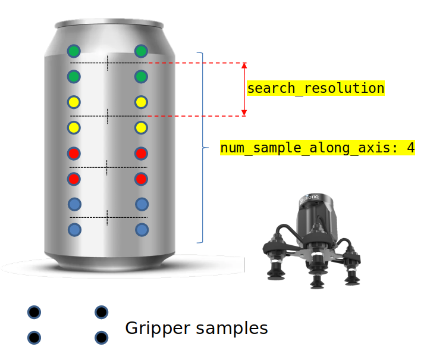
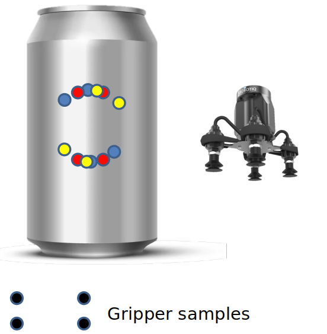

.. easy_manipulation_deployment documentation master file, created by
   sphinx-quickstart on Thu Oct 22 11:03:35 2020.
   You can adapt this file completely to your liking, but it should at least
   contain the root `toctree` directive.

.. _grasp_planner_parameters_suction_planning:

Grasp Planner Suction Parameters (Planning)
========================================================

These parameters directly affect the grasp planning aspects of the suction gripper

.. code-block:: bash

   grasp_planning_params:
     num_sample_along_axis: 3
     search_resolution: 0.01
     search_angle_resolution: 4
     weights:
       curvature: 1.0
       grasp_distance_to_center: 1.0
       number_contact_points: 1.0

Grasp sample Generation
----------------------------

These parameter affects the amount of grasp samples generated for each instance of grasp planning

<suction_gripper_name>.grasp_planning_params.num_sample_along_axis
^^^^^^^^^^^^^^^^^^^^^^^^^^^^^^^^^^^^^^^^^^^^^^^^^^^^^^^^^^^^^^^^^^^^^^

.. code-block:: bash

   num_sample_along_axis: 3

.. list-table::
   :widths: 5 20
   :header-rows: 0
   :stub-columns: 1

   * - Description
     - Total number of samples generated along the axis of the object
   * - Type
     - Int

.. note:: The greater the number, the more samples along the axis will be generated and tested, but the grasp planning times will increase

<suction_gripper_name>.grasp_planning_params.search_resolution
^^^^^^^^^^^^^^^^^^^^^^^^^^^^^^^^^^^^^^^^^^^^^^^^^^^^^^^^^^^^^^^^^^^^^^

.. code-block:: bash

   search_resolution: 0.01

.. list-table::
   :widths: 5 20
   :header-rows: 0
   :stub-columns: 1

   * - Description
     - Provides the distance between each generated sample along the axis of the object
   * - Type
     - Double

<suction_gripper_name>.grasp_planning_params.search_angle_resolution
^^^^^^^^^^^^^^^^^^^^^^^^^^^^^^^^^^^^^^^^^^^^^^^^^^^^^^^^^^^^^^^^^^^^^^

.. code-block:: bash

   search_angle_resolution: 4

.. list-table::
   :widths: 5 20
   :header-rows: 0
   :stub-columns: 1

   * - Description
     - Provides the number of rotated grasp samples within an entire rotation about a particular grasp sample
   * - Type
     - Int

.. note:: The greater the number, the more rotated samples generated, but the grasp planning times will increase.

Grasp Planning Weights
----------------------------

Parameters here directly contribute to the ranking of each suction grasp sample. Configure each of the weight based
on the user's particular use case and which attribute is more valued.

.. note:: Ensure that each weight is a positive value less than or equal to 1.

          For default values, users can leave all weights at 1.0

To find out more about how the grasp is being ranked, go to :ref:`grasp_planner_theory_suction`

<suction_gripper_name>.grasp_planning_params.weights.curvature
^^^^^^^^^^^^^^^^^^^^^^^^^^^^^^^^^^^^^^^^^^^^^^^^^^^^^^^^^^^^^^^^^^^^^^

.. code-block:: bash

   curvature: 1.0

.. list-table::
   :widths: 5 20
   :header-rows: 0
   :stub-columns: 1

   * - Description
     - Weights for the curvature component of the grasp ranking
   * - Type
     - Double

<suction_gripper_name>.grasp_planning_params.weights.grasp_distance_to_center
^^^^^^^^^^^^^^^^^^^^^^^^^^^^^^^^^^^^^^^^^^^^^^^^^^^^^^^^^^^^^^^^^^^^^^^^^^^^^^

.. code-block:: bash

   grasp_distance_to_center: 1.0

.. list-table::
   :widths: 5 20
   :header-rows: 0
   :stub-columns: 1

   * - Description
     - Weights for the distance to object center component of the grasp ranking
   * - Type
     - Double

<suction_gripper_name>.grasp_planning_params.weights.number_contact_points
^^^^^^^^^^^^^^^^^^^^^^^^^^^^^^^^^^^^^^^^^^^^^^^^^^^^^^^^^^^^^^^^^^^^^^^^^^^

.. code-block:: bash

   number_contact_points: 1.0

.. list-table::
   :widths: 5 20
   :header-rows: 0
   :stub-columns: 1

   * - Description
     - Weights for the number of contact point component of the grasp ranking
   * - Type
     - Double
