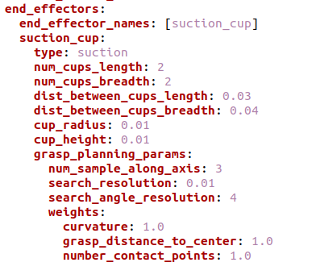
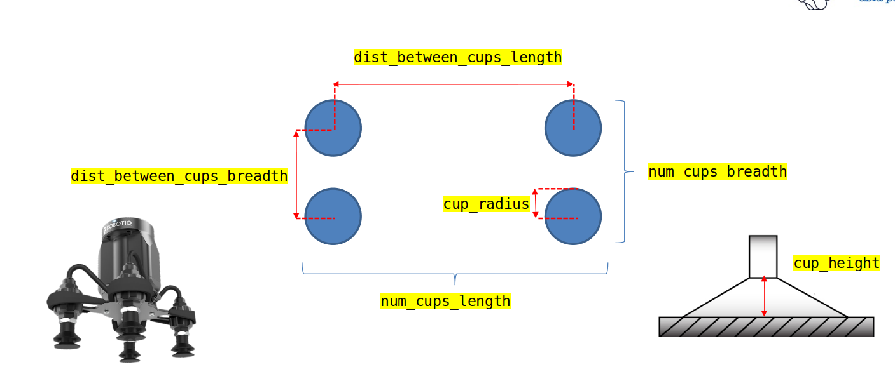
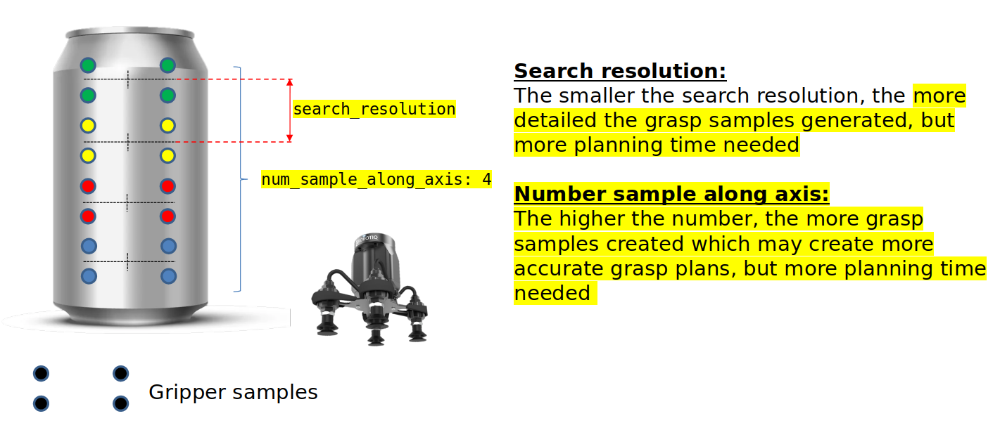
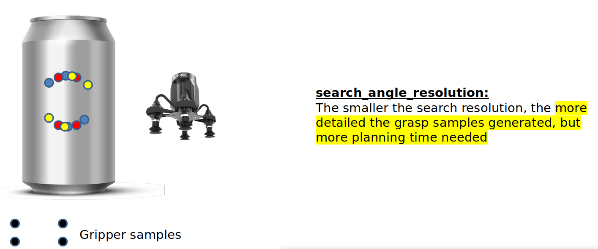
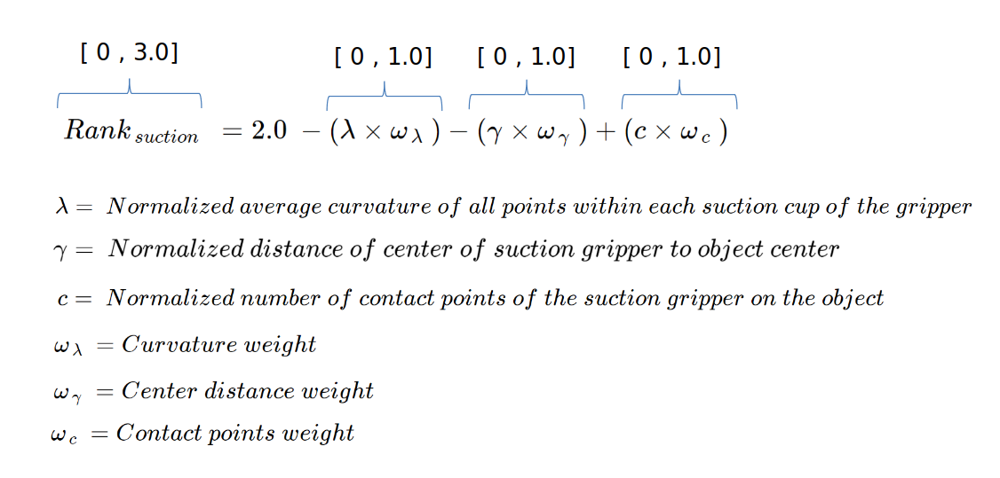

.. _grasp_planner_suction:

Suction Gripper
============================

The parameters for Suction Gripper end effectors are as follows:

+---------------------------+------------------------------------------------------------------------------------+
| Parameter                 |   Description                                                                      |
+===========================+====================================================================================+
| end_effector_names        |   Name of end effector                                                             |
+---------------------------+------------------------------------------------------------------------------------+
| *Replace ``suction_cup`` with Name of end_effector*                                                            |
+---------------------------+------------------------------------------------------------------------------------+
| type                      |   suction                                                                          |
+---------------------------+------------------------------------------------------------------------------------+
| num_cups_length           |   Number of cups the suction gripper has lengthwise (Shown in Figure 1)            |
+---------------------------+------------------------------------------------------------------------------------+
| num_cups_breadth          |   Number of cups the suction gripper has breadthwise (Shown in Figure 1)           |
+---------------------------+------------------------------------------------------------------------------------+
| dist_between_cups_length  |   Lengthwise distance between each suction cup  (Shown in Figure 1)                |
+---------------------------+------------------------------------------------------------------------------------+
| dist_between_cups_breadth |   Breadthwise distance between each suction cup  (Shown in Figure 1)               |
+---------------------------+------------------------------------------------------------------------------------+
| cup_radius                |   Radius of a single suction cup (Shown in Figure 1)                               |
+---------------------------+------------------------------------------------------------------------------------+
| cup_height                |   Height of suction cup from surface (Shown in Figure 1)                           |
+---------------------------+------------------------------------------------------------------------------------+
| num_sample_along_axis     |   Number of grasp samples created to search for a better grasp (Shown in Figure 2) |
+---------------------------+------------------------------------------------------------------------------------+
| search_resolution         |   Resolution between the num_sample_along_axis (Shown in Figure 2)                 |
+---------------------------+------------------------------------------------------------------------------------+
| search_angle_resolution   |   Angle resoultion in for every sample along axis (Shown in Figure 3)              |
+---------------------------+------------------------------------------------------------------------------------+
| curvature                 |   Weights for Suction Grasp Planner Ranking formula (Default value)                |
+---------------------------+------------------------------------------------------------------------------------+
| grasp_distance_to_center  |   Weights for Suction Grasp Planner Ranking formula (Default value)                |
+---------------------------+------------------------------------------------------------------------------------+
| number_contact_points     |   Weights for Suction Grasp Planner Ranking formula (Default value)                |
+---------------------------+------------------------------------------------------------------------------------+

- Determining ``num_cups_length``, ``num_cups_breadth``, ``dist_between_cups_length``, ``dist_between_cups_breadth``, ``cup_radius`` and ``cup_height``
  parameters are shown in Figure 1 below. 

+-----------+
| Figure 1  |
+===========+
||Figure_1| |
+-----------+

- Determining ``num_sample_along_axis`` and ``search_resolution`` parameters are shown in Figure 2 below.

+-----------+
| Figure 2  |
+===========+
||Figure_2| |
+-----------+

- Determining ``search_angle_resolution`` parameter is shown in Figure 3 below.

+-----------+
| Figure 3  |
+===========+
||Figure_3| |
+-----------+

Grasp Planning Metric (Suction)
=======================================

- The possible grasps on the object are ranked by utlizing this formula. The position and orientation of the best quality grasp is then published for ref::`grasp_execution_demo`. 

