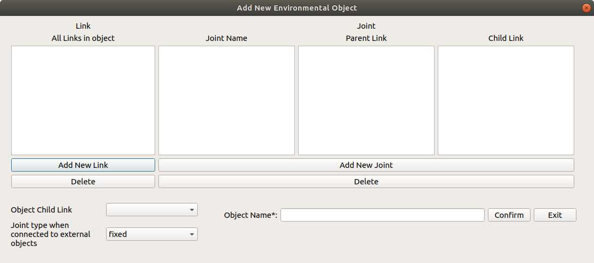
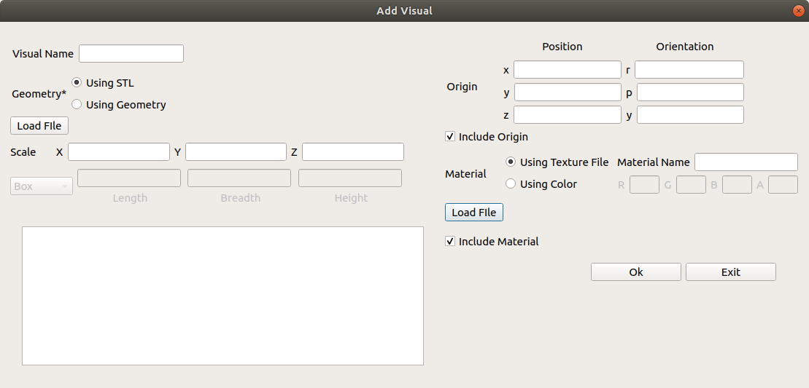
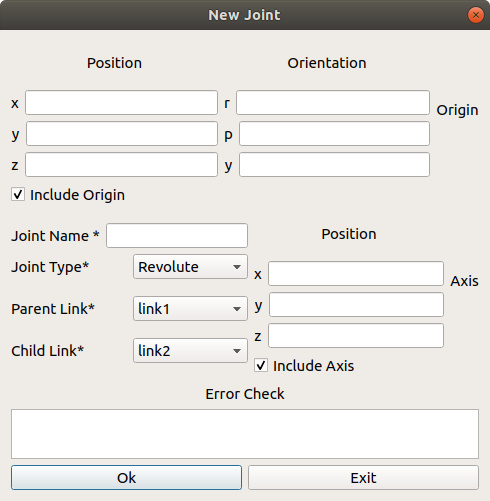

.. easy_manipulation_deployment documentation master file, created by
   sphinx-quickstart on Thu Oct 22 11:03:35 2020.
   You can adapt this file completely to your liking, but it should at least
   contain the root `toctree` directive.

.. _Create an object:

Create an object
========================================================

.. contents:: 
    :depth: 3

An environment object can be used to create a visual representation of an object in a real robotic workcell, or additionally to act as a collision object to be taken into account during path planning

An object is required to have minimally one link that will be used to connect to the external world. This link will be selected under the `Object Child Link` Field. The type of joint you would want to connect to the world is also specifed in the field below

Adding Links
^^^^^^^^^^^^^^

To find out more about each component, `Check out this link that describes the various aspects of a Link <http://wiki.ros.org/urdf/XML/link>`_

For an object, there should be at least one link that connects this object to the external world

Adding Visual Component
------------------------

The visual properties of the link. This element specifies the shape of the object (box, cylinder, etc.) for visualization purposes. 

Adding Inertial Component
----------------------------

This window allows you to add the inertial properties of the link. This aspect is __optional__ and will default to zero mass and zero inertia  if it is not specified.

.. image:: ../../images/new_inertia.png
   :scale: 75%
   :align: center
   

**Inertia**

The 3x3 rotational inertia matrix, represented in the inertia frame. Because the rotational inertia matrix is symmetric, only 6 above-diagonal elements of this matrix are specified here, using the attributes ixx, ixy, ixz, iyy, iyz, izz.

**Origin**

:ref:`Refer to this section <origin-explanations>`

**Mass**

Mass of the Link

Adding Collision Component
----------------------------

This allows you to describe the collision properties of the link. **To reduce computation time, simpler collision models can be used to describe the object compared to the visual components**

.. image:: ../../images/new_collision.png
   :scale: 75%
   :align: center

Adding Joints
^^^^^^^^^^^^^^^^^^^^^^^^^^^^^^
To find out more about each component, `Check out this link that described the various aspects of a Joint <http://wiki.ros.org/urdf/XML/joint>`_

**Note that as of this current implementation, only simple joint attributes are included. Other attributes like calibration, dynamics, limits, mimic, safety_controller, will be added in future iterations**

Inheritance
----------------------

When creating a joint for two links in an object, note that it is not possible for a link to be a parent of another link that is higher on the inheritance hierarchy

For example,

.. code-block:: bash

   Link A is a parent of Link B who is a parent of Link C
   A > B > C

   Link B is also a parent of Link D
   B > D

   By inheritance rules, Link D cannot be the parent of Link A (Because Link A is the parent of Link B)

Axis
----------------------

Represents the joint axis specified in the joint frame. Note that this field is disabled for **fixed and floating joints**.

.. _origin-explanations:

Origin Explanations
^^^^^^^^^^^^^^^^^^^^^^^^^

Note that there are many different origin sources for the Visual, Collision, Inertia and Joint aspects of the object. For each aspect of the link, all three (visual, collision and inertia) origins will be taken with respect to the **reference frame of the link**.

To find out where this reference frame is, we need to look at the **joint origin** . The following example shows, generally, how the joint origin relates to the link origin. 

.. image:: ../../images/link_joint1.png
   :scale: 75%
   :align: center

This configuration shows a :code:`link` connected to the :code:`base_link` with a joint origin of :code:`0,0,0` and the visual mesh of :code:`link` has an origin of :code:`0,0,1`. As you can see, :code:`link`'s tf is at the :code:`0,0,0` of :code:`base_link`, while the **visual** component of :code:`link` is at :code:`0,0,1` from the **tf** of :code:`link`

.. image:: ../../images/link_joint2.png
   :scale: 75%
   :align: center

In this configuration however, shows a joint origin of :code:`0,0,1` and the visual mesh of :code:`link` has an origin of :code:`0,0,0`. As you can see, :code:`link`'s **tf** is at the :code:`0,0,1` of :code:`base_link`, while the **visual** component of :code:`link` is at :code:`0,0,0` from the **tf** of :code:`link`
