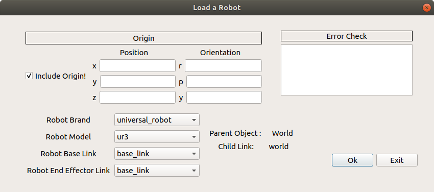

.. easy_manipulation_deployment documentation master file, created by
   sphinx-quickstart on Thu Oct 22 11:03:35 2020.
   You can adapt this file completely to your liking, but it should at least
   contain the root `toctree` directive.

.. _Create A Scene:

Create A Scene
========================================================

.. contents:: 
    :depth: 3

.. image:: ../../images/no_scene.png
   :scale: 75%
   :align: center

If there are currently no scenes in the "scenes" folder, you need need to add a new scene. Click **Add New Scene** .

You should be shown the window below, which is the start of scene creation. 

.. image:: ../../images/new_scene.png
   :scale: 75%
   :align: center

At this point, there are a few things you can do to populate the scene:

Adding a Robot into scene
^^^^^^^^^^^^^^^^^^^^^^^^^^^^^^

To add the robot into the workspace, check the **include robot** box and the add robot button

**Current implementation of this GUI assumes that the Robot is connected to the World link**. Manual editing of the world link can be done through the URDF. 

If the error " No robot is detected in the workcell folder" is seen in the Robot Brand and Robot Model Fields, it means that the robot description folder and moveit_config is not properly loaded. Refer to " Uploading Relevant Assets " in :ref:`workcell_initialization`

Otherwise, you will see the window below

In the dropdown menu, select the robot brand and model you would like to include in the work space

Origin
-----------------

The Origin is the positional and orientation coordinates values of the robot's **base link with respect to the World Link**. Unchecking the box defaults the XYZ and RPY coordinates to 0 

Robot Base Link
-------------------------

This is the link of the robot that will be connected to the World Link

Robot End Effector Link
--------------------------------

This is the link of the robot that will be connected to the End Effector Base Link

Adding an End Effector into scene
^^^^^^^^^^^^^^^^^^^^^^^^^^^^^^^^^^^^^^

To add the end effector into the workspace, check the **include end effector** box and the **add end effector** button

**Note that the end effector can only be included if the Robot is successfully loaded into the scene.**

If the error " No end effector is detected in the workcell folder" is seen in the End Effector Brand and End Effector Model Fields, it means that the end effector description folder and moveit_config folder is not properly loaded. Refer to [Uploading Relevant Assets](#uploading-relevant-assets)

Otherwise, you will see the window below

.. image:: ../../images/load_ee.png
   :scale: 75%
   :align: center

Origin
-----------------

The Origin is the positional and orientation coordinates values of the **end effector's base link with respect to the Robot's end effector link**. Unchecking the box defaults the XYZ and RPY coordinates to 0 

End Effector Link
-------------------

This is the link of the end effector (Usually the base link of the end effector) that will be connected to the Robot's End Effector Link (Usually the tip of the robot).

End Effector Type
---------------------------

Currently, the end effector types supported will be only for **2 Finger Grippers** and **Single Suction Cup**. Thus the attribute options cannot be selected at this moment. 

Adding Objects into scene
^^^^^^^^^^^^^^^^^^^^^^^^^^^^^^^^^^^^^^

.. toctree::
   :maxdepth: 2
   
   workcell_builder_create_object

Complete Scene
^^^^^^^^^^^^^^^^^^^^^^^^^^^^^^^^^^^^^^

Before you exit the Scene, ensure that a scene name is entered then click the OK button. You should be redirected back to the scene select window

Next step: :ref:`Generate Files and Folders`

