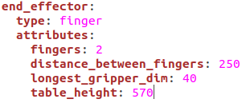
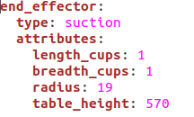

.. easy_manipulation_deployment documentation master file, created by
   sphinx-quickstart on Thu Oct 22 11:03:35 2020.
   You can adapt this file completely to your liking, but it should at least
   contain the root `toctree` directive.

.. _Grasp Planner Configuration:

Grasp Planner Configuration
========================================================

In order for the grasp planner to plan the right type of grasp, we need to first create a configuration file in the config folder , **attributes.yaml** . It is advised to write over the current **attributes.yaml** file to prevent any YAML parsing errors.

This File will be located in grasp_planner/config/attributes.yaml

Finger Gripper
^^^^^^^^^^^^^^^^^^

**fingers** 
---------------------------
Number of fingers for the end effector. **Currently only 2 fingered grippers are supported**

**distance_between_fingers**
------------------------------------
The distance between the fingers of the end effector(in mm). Using the Robotiq 2F-85 gripper as an example: 

**longest_gripper_dim**
-----------------------------------
The longest dimensions of a finger (in mm). Using the robotiq 2F-85 gripper:

**table_height**
------------------------------------
The distance between the camera used to capture the workspace and the surface on which the object is on.
  
**min_zero_angle**
------------------------------------
Minimum angle (in radians) that can be regarded as 0 rad. Increase this value to increase planning speeds (but might result in a less desirable grasp)

**min_height_diff_to_grip**
------------------------------------
Minimum height difference that can be gripped. Increase this to increase stability of grasps, but may lead to the grasp planner not finding any grasps if too high.

**min_gdi_diff_for_comparison**
------------------------------------
Used to determine when centroid position is taken into comparison. Increasing this number increases the consideration of centroid grasp position compared to finger collision

Suction Gripper
^^^^^^^^^^^^^^^^^^

**length_cups**
------------------------------------
The number of cups in the length dimension. **Currently only support value of 1**

**breadth_cups**
------------------------------------
The number of cups in the breadth dimension. **Currently only support value of 1**

**radius**
------------------------------------
The radius one of the suction cup.

**table_height**
------------------------------------
The distance between the camera used to capture the workspace and the surface on which the object is on.

