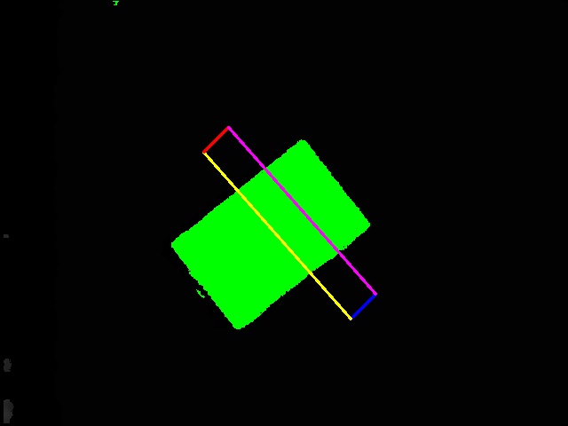

.. easy_manipulation_deployment documentation master file, created by
   sphinx-quickstart on Thu Oct 22 11:03:35 2020.
   You can adapt this file completely to your liking, but it should at least
   contain the root `toctree` directive.

.. _grasp_validator:

Grasp Validator
========================================================

This Python package serves as a troubleshooting tools to visualize your grasps as well as to check the accuracy of your depth camera. There are two main programs you can run: 

**Grasp Validator**
Visualize your grasps from the perspective of the camera to validate the quality of the generated grasp plan

**Depth Checker**
Visualize plane filtering with respect to the table height

Before running this package
^^^^^^^^^^^^^^^^^^^^^^^^^^^^^
As this is a troubleshooting toolkit, you are required to have a few files for the package to work

depth_img.jpg
-----------------

(Located in workcell_ws/src/easy_perception_deployment/grasp_validator/images/)

This is the depth image (jpg, png) file from the depth camera. Please ensure that it is the **depth image** not an RGB image. Typically this image will be either pitch black/greyish to the naked eye. The size of the image **must also be the exact pixel dimensions** that the perception system sends to the grasp planner, as the visualization uses the coordinates of this depth image. 

.. image:: ./images/depth_img.jpg
   :scale: 40%
   :align: center

grasps.txt
-----------

(Located in workcell_ws/src/easy_perception_deployment/grasp_validator/results/)

This file contains the output of the grasp planner. This is automatically generated by the grasp planner.

For a two finger gripper, the grasps.txt file should have 8 comma separated integers, representing corner coordinates of the gripper

For a suction gripper, the grasps.txt file should have 3 comma separated integers, representing the center coordinates of the suction cup, and the pixel radius of the suction cup.

object_coordinates.txt 
-----------------------

(Located in workcell_ws/src/easy_perception_deployment/grasp_validator/results/)

This file contains the filtered coordinates of the work area . This is automatically generated by the grasp planner.

The file will store coordinates of areas which are higher (Lower in depth value) than the table surface. 

Running the depth checker
^^^^^^^^^^^^^^^^^^^^^^^^^^^^^

.. code-block:: bash

   ros2 run grasp_validator depth_checker
   
Your depth image will now have marked areas that shows the surfaces higher than the grasp surface. Ideally you would want the marked areas to represent the object surfaces. If there are other areas highlighted in the image, you might need to either increase the depth value of the table, or move your grasp surface to a flatter surface. **A noisy depth image may lead to inaccurate grasp planning**
   
.. image:: ./images/depth_checker.jpg
   :scale: 75%
   :align: center

Running the grasp validator
^^^^^^^^^^^^^^^^^^^^^^^^^^^^^

.. code-block:: bash

   ros2 run grasp_validator validator

Depending on the type of gripper, the output will show the annotated depth images.

   
   
.. image:: ./images/validator_suction.png
   :scale: 75%
   :align: center

   

