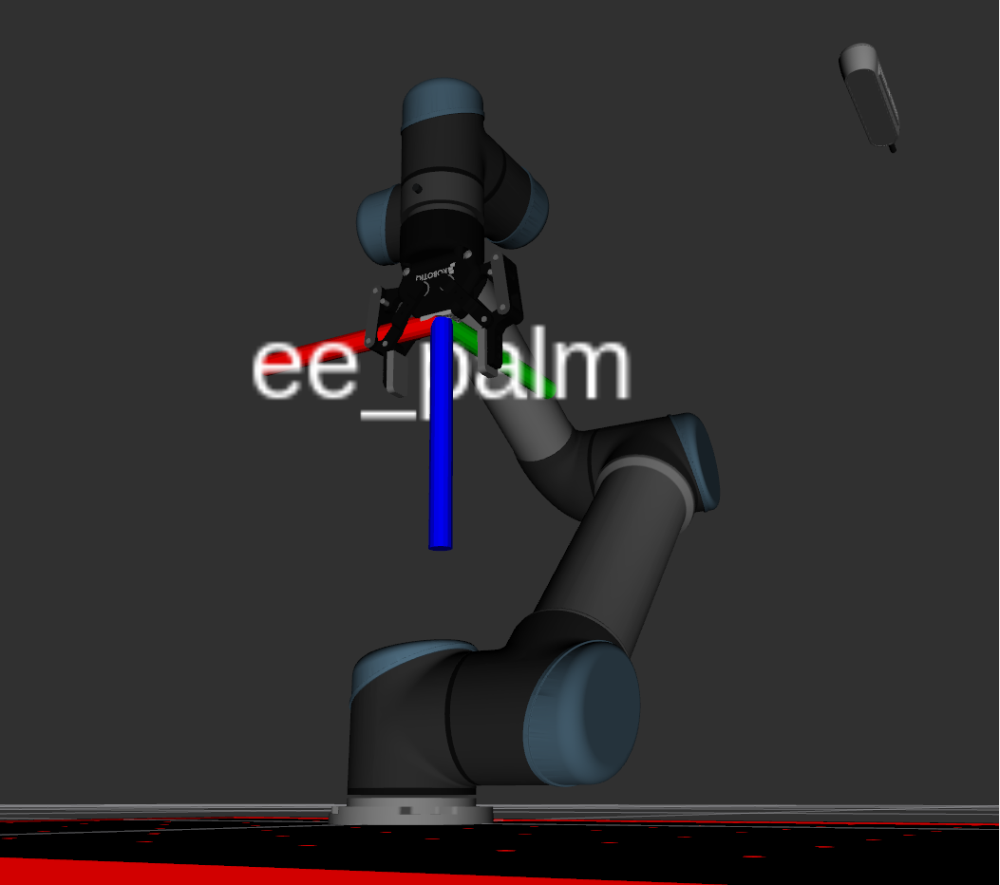
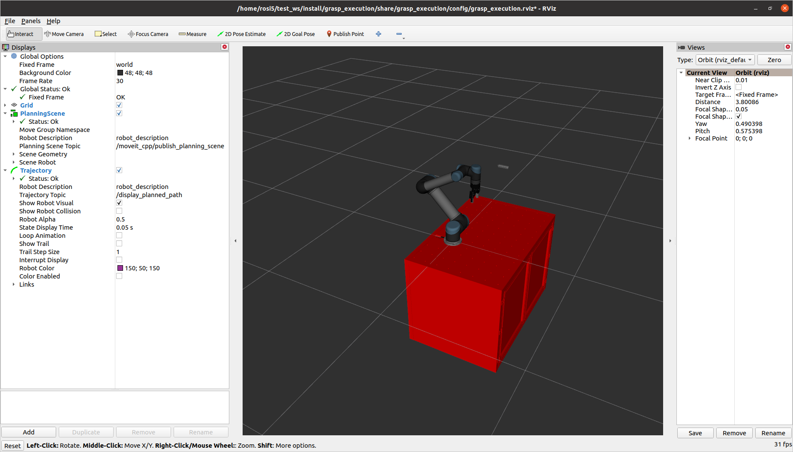

.. easy_manipulation_deployment documentation master file, created by
   sphinx-quickstart on Thu Oct 22 11:03:35 2020.
   You can adapt this file completely to your liking, but it should at least
   contain the root `toctree` directive.

.. _grasp_execution_example:

Grasp Execution Example
========================================================

Currently the grasp execution portion of the package is under heavy development, but for now there is a basic example to execute the grasp plan. 

In the example we will use the perception ROS2 bag as the input. 

Grasp execution configuration
^^^^^^^^^^^^^^^^^^^^^^^^^^^^^^^^^^^^^^^

Grasp execution launch file
-------------------------------

First we need to configure the grasp execution launch file. In :code:`/workcell_ws/src/easy_manipulation_deployment/grasp_execution/launch/grasp_execution.launch.py` , make sure you define the correct scene package for the grasp execution, and the correct base link of the robot. 

.. code-block:: bash

   scene_pkg = 'new_scene'
   robot_base_link = 'base_link'

Scene URDF File
-------------------------------
In :code:`/workcell_ws/src/scenes/new_scene/urdf/scene.urdf.xacro`, add the following lines *before* the :code:`robot` tag:

.. code-block:: bash

   <link name="ee_palm" />
   <joint name="base_to_palm" type="fixed">
      <parent link="tool0"/>
      <child link="ee_palm"/>
      <origin xyz="0 0 0.09" rpy="0 0 0"/>
   </joint>

This link, :code:`ee_palm` represents the point of contact with respect to the grasp object. 

Grasp execution node file
-------------------------------

In :code:`/workcell_ws/src/easy_manipulation_deployment/grasp_execution/src/grasp_execution_node.cpp`,edit the following line to reflect the link of the end effector that will represent the point of contact with respect to the grasp object. In this case, it will be :code:`ee_palm`.

.. code-block:: bash

   demo.init("manipulator", "ee_palm");

Running full pipeline
^^^^^^^^^^^^^^^^^^^^^^

After making the changes, remember to build the workspace. In :code:`/workcell`, 

.. code-block:: bash

   colcon build
   source install/setup.bash

The next part requires three different terminals.

Terminal 1: Grasp Execution
----------------------------
This terminal runs the manipulation workspace simulation. First, source all relevant repositories. In :code:`/workcell`,

.. code-block:: bash

   source /opt/ros/foxy/setup.bash
   source ~/moveit2_ws/install/setup.bash
   source install/setup.bash

Next, launch the grasp execution component.

.. code-block:: bash

   ros2 launch grasp_execution grasp_execution_launch.py

You should then see rviz launch and the scene.

Terminal 2: Grasp Planner
----------------------------
This terminal runs the grasp_planner. First, source all relevant repositories. In :code:`/workcell`,

.. code-block:: bash

   source /opt/ros/foxy/setup.bash
   source ~/moveit2_ws/install/setup.bash
   source install/setup.bash

Next, launch the grasp planner.

.. code-block:: bash

   ros2 run grasp_planning grasp_planning_node 

You should then see the following

.. code-block:: bash

   [easy_manipulation_deployment][Grasp Planner] Waiting for topic....

Terminal 3: Perception example rosbag
--------------------------------------
This terminal runs the perception example. First, source all relevant repositories. In :code:`/workcell`,

.. code-block:: bash

   source /opt/ros/foxy/setup.bash
   source ~/moveit2_ws/install/setup.bash
   source install/setup.bash

Next, run the rosbag

.. code-block:: bash

   ros2 bag play src/easy_manipulation_deployment/grasp_planner/rosbag/perception_example/rosbag/rosbag2_2020_09_25-15_54_55_0.db3
   
You should then see the following

.. code-block:: bash

   [INFO] [1605754174.300681975] [rosbag2_storage]: Opened database 'src/easy_manipulation_deployment/grasp_planner/rosbag/perception_example/rosbag/rosbag2_2020_09_25-15_54_55_0.db3' for READ_ONLY.
   

Ideally, if all components run in sequence, you should then see the manipulator simulation move in Rviz. The object will be picked up and placed at a drop off location before going back to the home position. 

