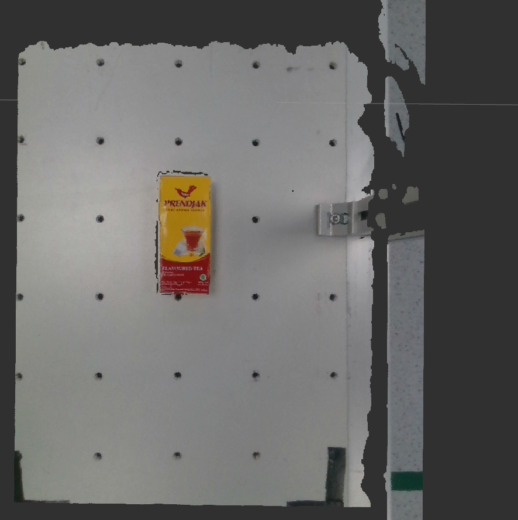
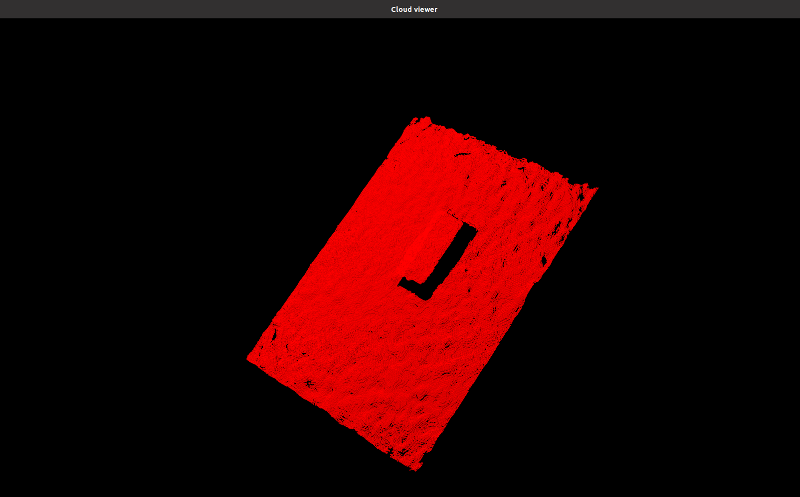
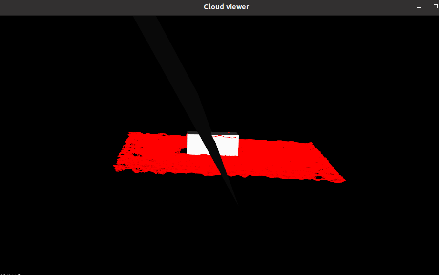
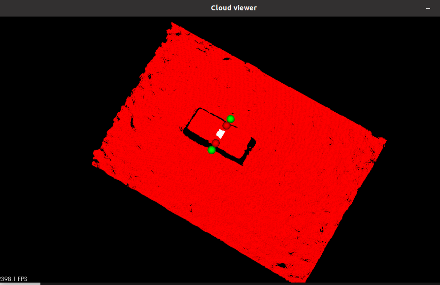

Grasp Planner Example
=====================

In this part of the tutorial we will reference the scene we have generated in the :ref:'Workcell Builder Example'

Currently, perception data inputs for the Grasp Planner only works with:

    #. /pointcloud`Pointcloud <https://en.wikipedia.org/wiki/Point_cloud>`_ 
    #. `Easy Perception Deployment <https://github.com/ros-industrial/easy_perception_deployment>`_ (EPD)

**Do take note that the topics currently have to be named /camera/pointcloud for Pointcloud** or
**/processor/epd_localize_output for EPD**
 
If you currently do not have a working perception system, you can still test out the package using either the epd_rosbag or pointcloud_rosbag located in *PATH TO ROSBAG folder TO BE WRITTEN* 

The rosbags are using the stream of a simple tea box as shown below.

.. note::
        Prority is given to `Easy Perception Deployment <https://github.com/ros-industrial/easy_perception_deployment>`_ data if both `Pointcloud <https://en.wikipedia.org/wiki/Point_cloud>`_ and `Easy Perception Deployment <https://github.com/ros-industrial/easy_perception_deployment>`_  are running simultaneously.

Set up end effector parameters
------------------------------

The current version of Grasp Planner is able support End-effectors for both multiple suction arrays and multiple fingered grippers.

For the example, we will utilize the **2-Finger gripper** in line with the End-Effector used for the scene in :ref:`workcell_builder_example`

The configuration files need to be set according to the type of End-effector that is being used.
In the configuration file *PATH TO CONFIG FILE*, replace the contents with the following based of the desired end_effector:

2-Finger gripper
################
.. code-block:: bash

    end_effectors:
      end_effector_names: [robotiq_2f]
      robotiq_2f:
        type: finger
        num_fingers_side_1: 1
        num_fingers_side_2: 1
        distance_between_fingers_1: 0.0
        distance_between_fingers_2: 0.0
        finger_thickness: 0.02
        gripper_stroke: 0.085
        grasp_planning_params:
          grasp_plane_dist_limit: 0.007
          voxel_size: 0.01
          grasp_rank_weight_1: 1.5
          grasp_rank_weight_2: 1.0
          world_x_angle_threshold: 0.5
          world_y_angle_threshold: 0.5
          world_z_angle_threshold: 0.25

Running the Grasp Planner
-------------------------

This part of the example requires 2 terminals. We will be running the epd_rosbag for the example.

*In terminal 1:* (Grasp Planner Terminal)

.. code-block:: bash

    source /opt/ros/foxy/setup.bash
    
    source PATH_TO_MOVEIT_WS/install/setup.bash
    
    cd PATH_TO_EMD_WS/
    
    colcon build 
    
    source install/setup.bash
    
    ros2 launch grasp_planner grasp_planner_launch.py 

Once successfully launched, :code:`waiting...` should be seen Terminal 1 and a seperate screen :code:`Cloud viewer` will pop out. 

.. note::
    Take note that Grasp Execution should be launched first as the Grasp Planner requires the frame :code:`camera_color_optical_frame` to be present.
    If not the following will be shown on Terminal 1:

.. code-block:: bash

    [pcl_test_node-1] [INFO] [1617252094.561454528] [pcl_node]: Message Filter dropping message: frame 'camera_color_optical_frame' at time 0.000 for reason 'Unknown'

*In terminal 2:* (Rosbag/Perception stream Terminal)

.. code-block:: bash

    source /opt/ros/foxy/setup.bash    
    
    cd PATH_TO_EMD_WS/
    
    source install/setup.bash
    
    cd PATH_TO_CAMERA/EPD_ROSBAG
    
    ros2 bag play epd_rosbag.db3

.. note:: 
    This step uses the rosbag as an example, you can provide your own stream of pointcloud/EPD data. 

Once successfully launched, the output should be as shown below on Terminal 2.

.. code-block:: bash

    [INFO] [1617251978.247342106] [rosbag2_storage]: Opened database 'epd_rosbag.db3' for READ_ONLY.

Viewing grasping results on Cloud viewer
----------------------------------------

The :code:`Cloud viewer` window will then load the frame of the perception input data as shown below:

Click on the :code:`Cloud viewer` window and press :code:`Q`. The Grasp Planner will then process the pointcloud data, showing the Bounding Box of 
the object/objects in the :code:`Cloud viewer` window,

Continue to press :code:`Q` to visualize all of the possible grasps on the object.

The grasps are ranked based off the quality of their grasps. The pose and orientation of the top ranked grasp will then be published for :ref:`grasp_execution_example`

