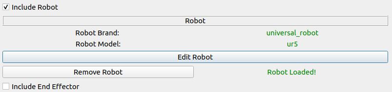

.. easy_manipulation_deployment documentation master file, created by
   sphinx-quickstart on Thu Oct 22 11:03:35 2020.
   You can adapt this file completely to your liking, but it should at least
   contain the root `toctree` directive.

.. _workcell_builder_example_ee:

Adding an end effector
=============================

In the scene creation window, check the :code:`Include End Effector` and click :code:`Add End Effector`

In the :code:`End Effector Brand` field , choose :code:`robotiq_85_gripper` 

In the :code:`End Effector Model` field, choose :code:`robotiq_85` 

In the :code:`End Effector Link` field, choose :code:`gripper_base_link` 

In the :code:`End Effector Type` field, choose :code:`finger` 

In the :code:`Fingers` field, choose :code:`2` 

Since we want the end effector to be right at the point of the robot's end effector link, we can leave the origin field unchecked. If you want a certain offset for your end effector with respect to the robot, you can add an origin component with your required values. Your final window should look like this:

.. image:: ./images/example/example_ee_loaded.png

click :code:`Ok` , and the scene creation window will show an end effector loaded confirmation as well. 

Next step: :ref:`workcell_builder_example_object`
