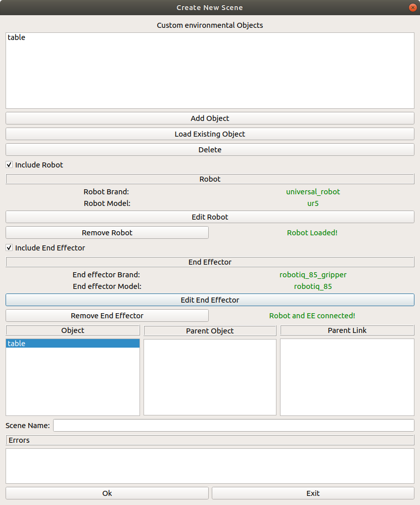
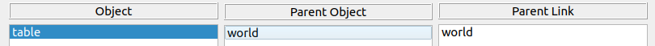
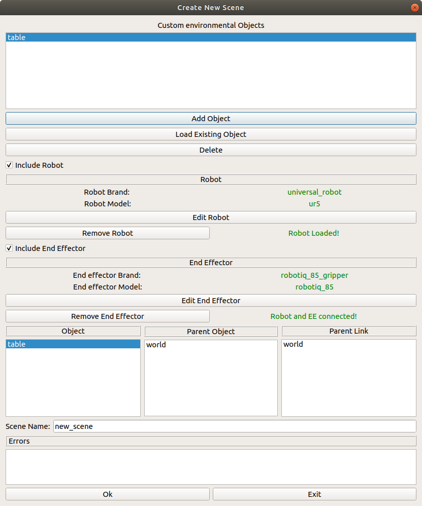

.. easy_manipulation_deployment documentation master file, created by
   sphinx-quickstart on Thu Oct 22 11:03:35 2020.
   You can adapt this file completely to your liking, but it should at least
   contain the root `toctree` directive.

.. _workcell_builder_example_extj:

Adding External joints for Objects
-----------------------------------

Linking table to the external world
^^^^^^^^^^^^^^^^^^^^^^^^^^^^^^^^^^^^

Awesome! You now have all the objects you require for the scene: A table, a manipulator, and an end effector. While the end effector and manipulator are automatically attached to the world (The manipulator is connected to :code:`world` link and the end effector is connected to the manipulator's :code:`ee_link` link), the table is currently not connected (As shown in the :code:`parent link` and :code:`child link` columns being empty)

To connect the table, we will create an external joint. Double click the :code:`table` entry under the :code:`Object` column (**Not** under the :code:`custom objects` !) 

.. image:: ../../images/example/example_no_extj.png

You should then see the :code:`add new external joint` window pop up as shown below

.. image:: ../../images/example/example_ext_joint.png

**For now, environmental objects can only be attached to other environmental objects**. Since the table is the only environmental objects in the scene, the only link you can connect to is :code:`world`. If you have added more environment objects in scene, they will be displayed here. 

For the table, since we want the table to be also connected to the origin of the world, where the base of the manipulator is located. Hence, we can just leave the origin checkbox unchecked (which defaults to xyz(0,0,0) and rpy(0,0,0)). You will then also see that the child link and child object are displayed there as well, based on the object name and the external joint child link you selected during object creation. 

click :code:`Ok`, and in the :code:`Create New Scene` Window, you should now see the :code:`Parent Object` and :code:`Parent Link` Columns being filled with *world* . Your table is now successfully connected to the scene!

You are now officially done with creating your scene. Make sure to name your scene and then click :code:`OK`. 

Next step: :ref:`workcell_builder_example_files`

