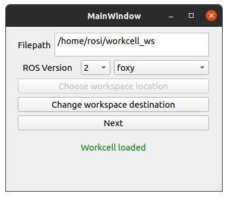
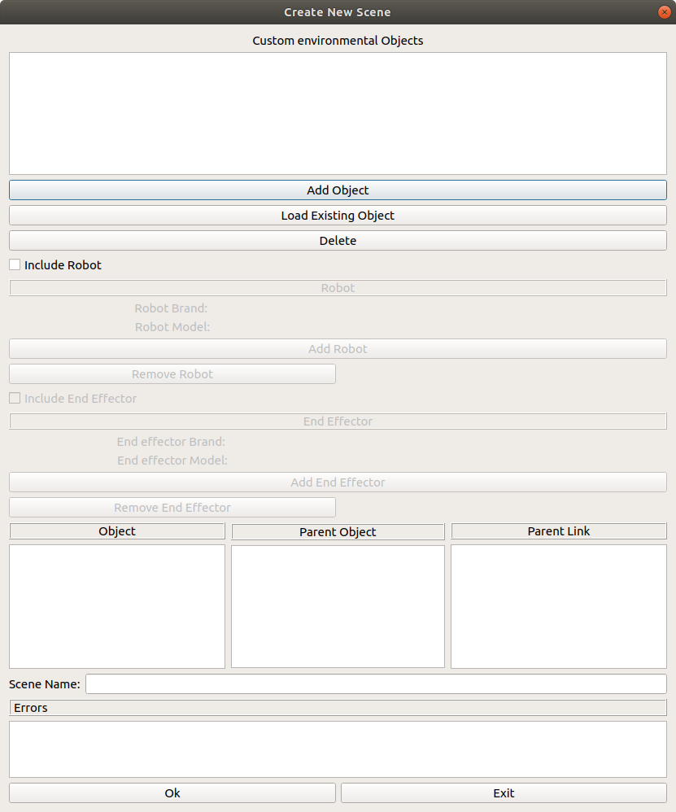

.. easy_manipulation_deployment documentation master file, created by
   sphinx-quickstart on Thu Oct 22 11:03:35 2020.
   You can adapt this file completely to your liking, but it should at least
   contain the root `toctree` directive.

.. _workcell_builder_example_gui:

Starting the Workcell Builder
===============================

**In the working directory** :code:`/workcell_ws/` (Important!), run the workcell builder

.. code-block:: bash
   
   workcell_builder

.. image:: ../../images/example/example_main_window.png

Set the ROS version and Distro to ROS2 Foxy. Next, click :code:`Choose workspace location` and select the filepath to :code:`workcell_ws` . You should see a green confirmation message that the workcell is loaded. 

Click :code:`Next`. you will then see the scene selection screen. Click on :code:`New Scene`. 

.. image:: ../../images/example/example_scene_select.png

Next step: :ref:`workcell_builder_example_manipulator`

