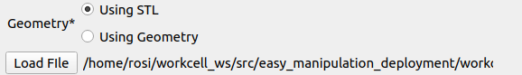
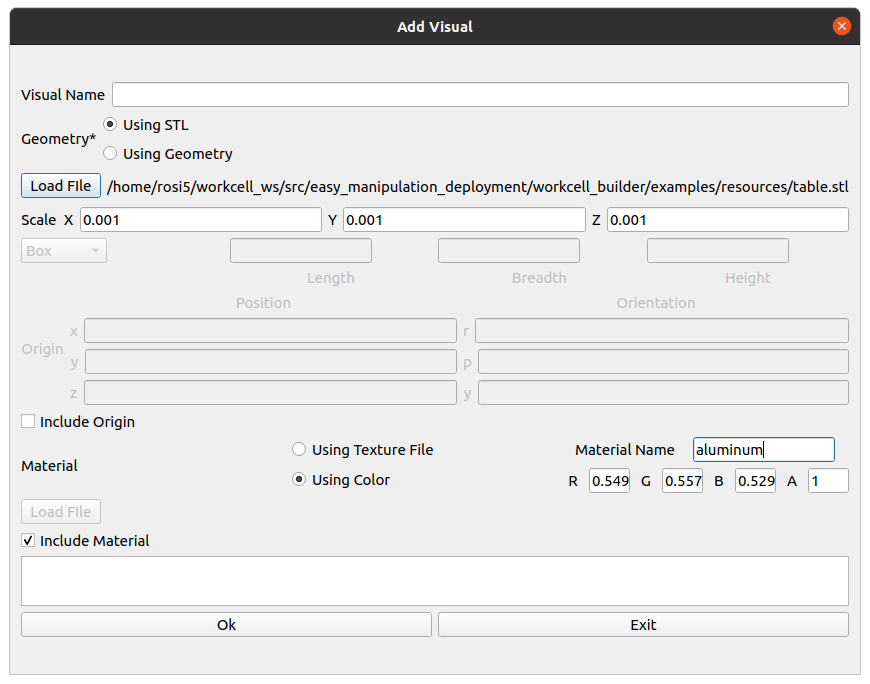
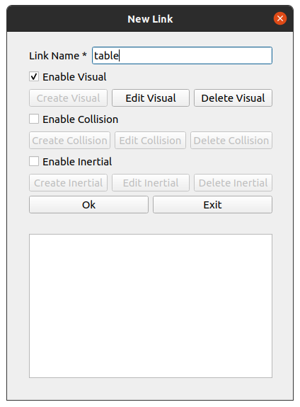
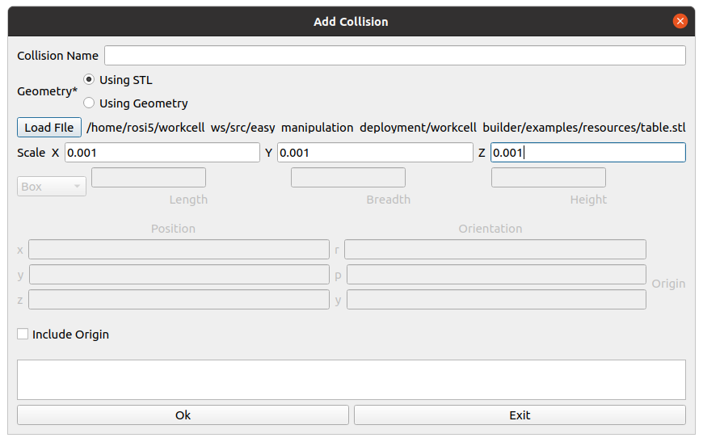
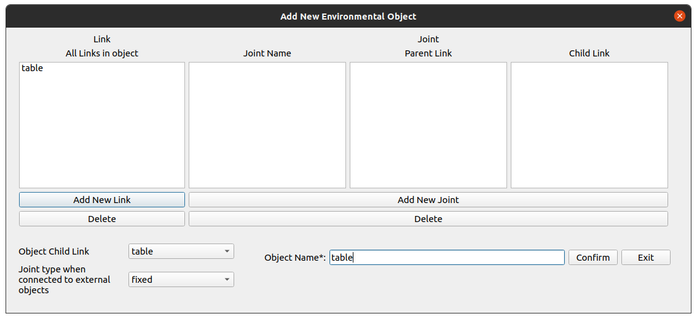

.. easy_manipulation_deployment documentation master file, created by
   sphinx-quickstart on Thu Oct 22 11:03:35 2020.
   You can adapt this file completely to your liking, but it should at least
   contain the root `toctree` directive.

.. _workcell_builder_example_object:

Adding an Object
-----------------

**This portion of the tutorial is to provide a guide on how to add a new object using the STL files. if you are planning on just using the existing table package created for you, skip to:** :ref:`workcell_builder_example_load_object`

Next, we will create an Environment Object, the table. Click :code:`Add Object` 

In the :code:`Object Name`, give your object a name, i.e *table*. 

Click on :code:`Add New Link`.

Create visual component of link
^^^^^^^^^^^^^^^^^^^^^^^^^^^^^^^^^

Give your link a name, e.g "table". In order to visualize the object, you need to have a link with a visual component. Check :code:`Enable Viusal` and click :code:`Create Visual`

.. image:: ../../images/example/example_add_visual.png

For this example, we will use an stl file. Select :code:`Using STL` and click :code:`Load File` . Select the location of your stl file. For this example, the :code:`table.stl` file will be located at :code:`/workcell_ws/src/easy_manipulation_deployment/workcell_builder/examples/resources/` . The stl file is currently too big, so we shall resize it by a factor of 0.001 on all axes (X, Y, Z)

The table in this example will also be at the origin of the workcell world, so we will leave the origin unchecked.

.. image:: ../../images/example/example_visual_origin.png

The workcell table we have is slightly grey. Uncheck the :code:`Include Material` , toggle to :code:`Using color` and enter the following numbers into the RGBA fields. Name the material "aluminum".

.. image:: ../../images/example/example_visual_material.png

Your final visual_link window should look like this:

Click ok. 

Create Collision component of link
^^^^^^^^^^^^^^^^^^^^^^^^^^^^^^^^^^^

Next, if you want this table object to be accounted for as a collision object, you need to add a collision component. Check :code:`Enable Collision` and click :code:`Create Collision`

The steps to filling up this window is identical to adding visual component, where you add in the geometry. Similar to the visual component, you want your collision component to be in the shape of the table as well, hence we use the same stl as before. 

Your final collision_link window should look like this:

For this example, we do not require an inertial component so we will skip that option. Your final new link window should look like the following

.. image:: ../../images/example/example_new_link_done.png

Click Ok. Your link should now be displayed in the link window. 

.. image:: ../../images/example/example_link_table.png

As this is a relatively simple environment object, there is only one link needed, and hence no internal joints need to be declared. 

Set external joint attributes
^^^^^^^^^^^^^^^^^^^^^^^^^^^^^^^^^^^

In a scene, all objects need to be connected by at least one link on the object (as the child link) to another link (parent link) via an external joint. The only exception is :code:`world` , which is an independant link that does not need to be connected to any object. In other words, it is the first parent link of the entire scene tree. 

For our table, we will first choose the :code:`child_link` that we want for the external joint, as well as the external joint type. For now, since the table only has one link, we select the link :code:`table` . Set the external joint type to be :code:`fixed` as well. 

Make sure to name your object as well. We can simply name it *table*

Your final :code:`Add New Environmental Object` window should look like this:

Click :code:`confirm`

Next step: :ref:`workcell_builder_example_extj`

