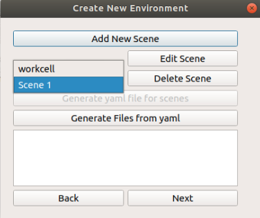

.. easy_manipulation_deployment documentation master file, created by
   sphinx-quickstart on Thu Oct 22 11:03:35 2020.
   You can adapt this file completely to your liking, but it should at least
   contain the root `toctree` directive.

.. _Editing Existing Scene:

Editing Existing Scene
========================================================

If you want to edit the existing scene, there are multiple ways you can do so. The first way is to directly edit the :code:`environment.yaml` file for minor changes. **Do note that you need to follow the YAML format for editing files, if not errors will be thrown.**

Loading YAML file into GUI
^^^^^^^^^^^^^^^^^^^^^^^^^^^

To load a yaml file into the GUI, you need to ensure that the **scene folder** is located in the workcell_ws/src/scenes/<scene_name>/ folder. You also need to make sure you have the **environment.yaml** file in the workcell_ws/src/scenes/<scene_name>/ folder as well, if not the GUi will not be able to load the files to edit. 

If the scene can be found, it will be available to be clicked to be edited.

Ensure that after you edit the scene, follow the rest of the steps in ref:`Generate Files and Folders` to re-generate the required files. 
