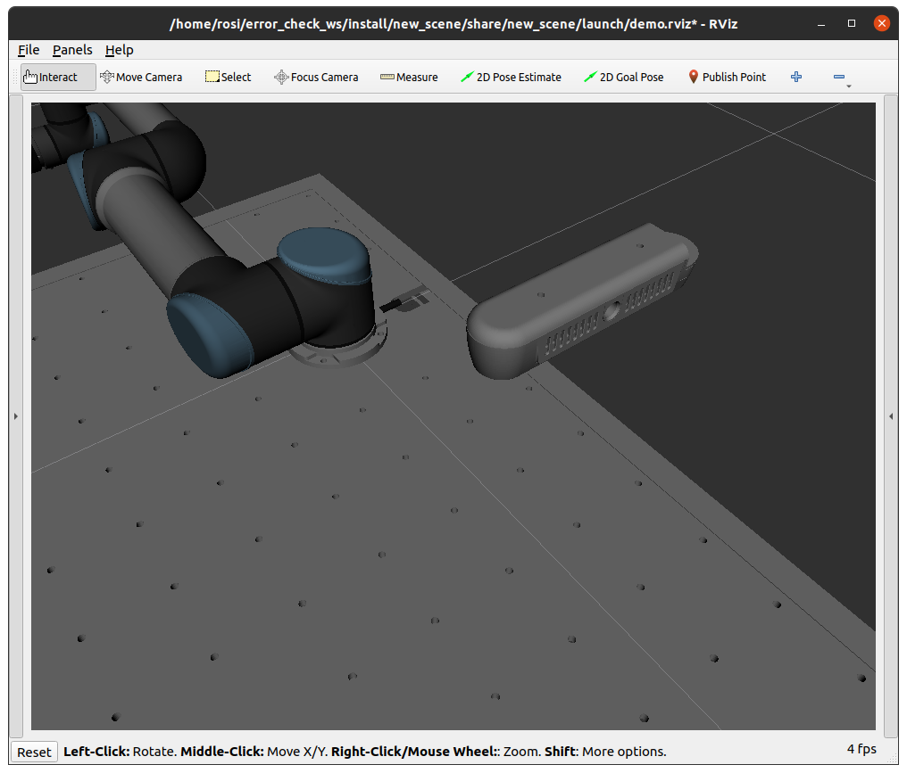
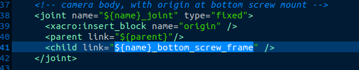
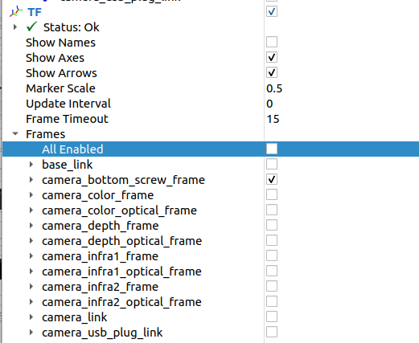
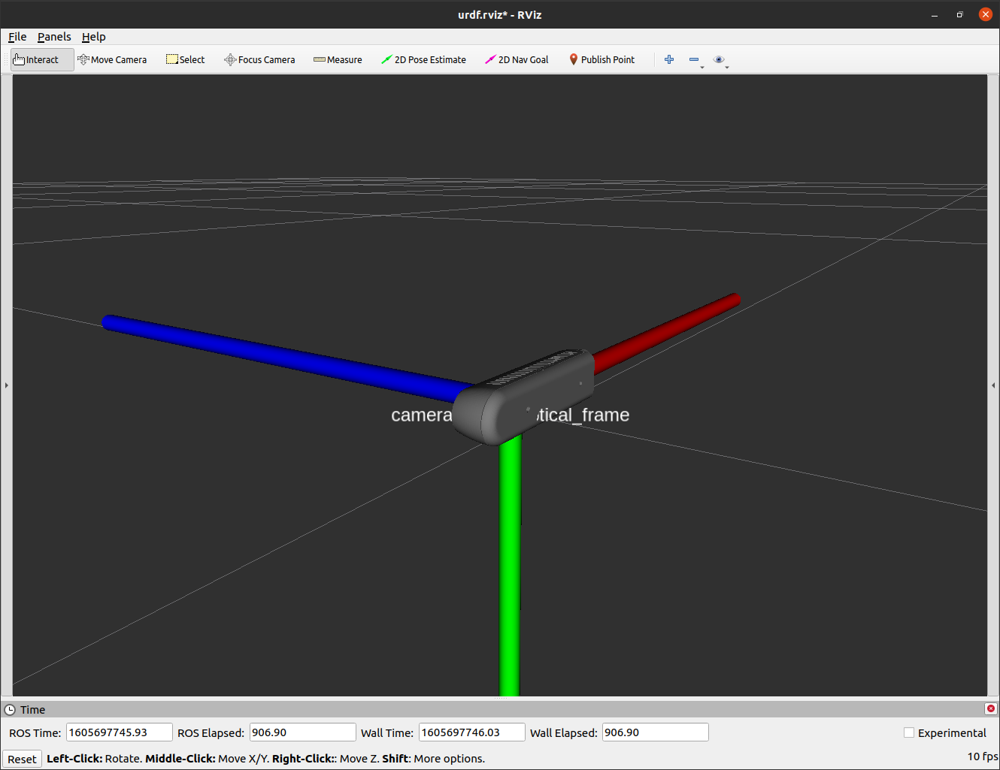

.. easy_manipulation_deployment documentation master file, created by
   sphinx-quickstart on Thu Oct 22 11:03:35 2020.
   You can adapt this file completely to your liking, but it should at least
   contain the root `toctree` directive.

.. _workcell_builder_example_camera:

Adding a camera to the scene
----------------------------

For manipulation systems with cameras, you would need to have a representation of the camera in the scene. The current workcell builder version **does not support**  camera addition via the gui, but in this tutorial we will teach you how to add a camera to the scene.  

For this example, we will adding the **Intel Realsense D415** depth camera in the scene.

Downloading Camera Description Folder
^^^^^^^^^^^^^^^^^^^^^^^^^^^^^^^^^^^^^^^

**Note that the default easy_manipulation_deployment package includes the intel realsense camera in the assets/environment/realsense2_description directory, but this portion provides a step by step guide on replicating it for other cameras. If you are planning to use what was provided, skip to the next step, "Add the camera to the scene"**

In the directory :code:`/workcell_ws/src/assets/environment/` , download the realsense repository

.. code-block:: bash

   git clone https://github.com/IntelRealSense/realsense-ros.git -b foxy

Only keep the :code:`realsense2_description` folder. Your :code:`/workcell_ws/src/assets/environment/` folder should be as shown: 

.. image:: ./images/example/example_realsense_folder.png

Next, build your package again to make sure that the realsense package builds correctly. 

.. code-block:: bash

   source /opt/ros/foxy/setup.bash

   cd ~/workcell_ws
   
   colcon build
   
   source install/setup.bash

Add the camera to the scene
^^^^^^^^^^^^^^^^^^^^^^^^^^^^^^^^^^^^^^^

Now we shall add the camera to the scene we created previously, :code:`new_scene` . 

Open up the urdf file in :code:`/workcell_ws/src/scenes/new_scene/urdf/scene.urdf.xacro` and add the following lines **before** the :code:`</robot>` tag: 

.. code-block:: bash

      <xacro:include filename="$(find realsense2_description)/urdf/_d415.urdf.xacro"/>
         <xacro:arg name="use_nominal_extrinsics" default="true" />
         <xacro:sensor_d415 parent="table_" use_nominal_extrinsics="$(arg use_nominal_extrinsics)">
          <origin xyz="-0.58 0.225 0.65" rpy="3.14159 1.57079506 0"/>
      </xacro:sensor_d415>

Now, rebuild the package and launch the demo visualization

.. code-block:: bash

   source /opt/ros/foxy/setup.bash

   cd ~/workcell_ws/src
   
   colcon build
   
   source install/setup.bash
   
   ros2 launch new_scene demo.launch.py
   
you should see the camera in scene.

Checking camera frame reference
^^^^^^^^^^^^^^^^^^^^^^^^^^^^^^^^^^^^^^^

First we need to check which link is the child link when connecting the camera to the xacro. This can be found in :code:`/workcell_ws/src/assets/environment/realsense2_description/urdf/_d415.urdf.xacro`

From the URDF we can see that the link that is connected to the external scene is :code:`${name}_bottom_screw_frame`. 

Next, We will launch RViz to check the orientation of this link.

.. code-block:: bash

   ros2 launch realsense2_description view_model.launch.py model:=test_d415_camera.urdf.xacro

On the RViz GUI left panel, in order to see the frame, make sure to only check that link, and also increase the Marker Scale to about 0.5.

For some cameras, the link representing the model may not be in the same orientation as the actual camera frame the perception system references . This can be shown in RViz,

.. image:: ./images/example/example_d415_screw_frame.png

This is how we are currently referencing the camera in the scene. However, based off the perception system we are using (easy_perception_system), the actual camera frame is supposed to be as shown below.

To do so, we need to add a link in this orientation in the URDF. In the file :code:`/workcell_ws/src/scenes/new_scene/urdf/scene.urdf.xacro` add the following lines under the declaration of the camera object: 

.. code-block:: bash

    <link name="camera_frame" />
    <joint name="d415_to_camera" type="fixed">
    	<parent link="camera_link"/>
    	<child link="camera_frame"/>
    	<origin xyz="0 0 0" rpy="1.57079506 0 1.57079506"/>
    </joint>

This adds a new frame :code:`camera_frame` that will be the frame in which the object is detected, and the frame that will be transformed to the world frame during the grasp execution phase of the pipeline.

Now that we have the main scene set up, we can move on to the grasp planner: :ref:`grasp_planner_example`

