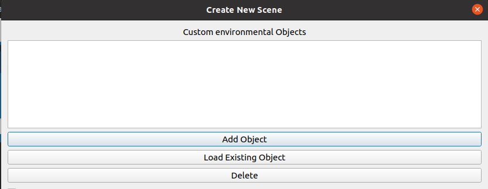
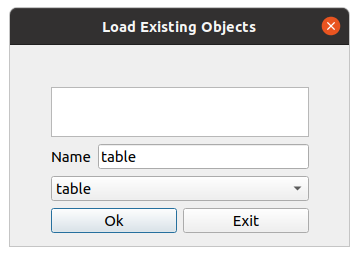
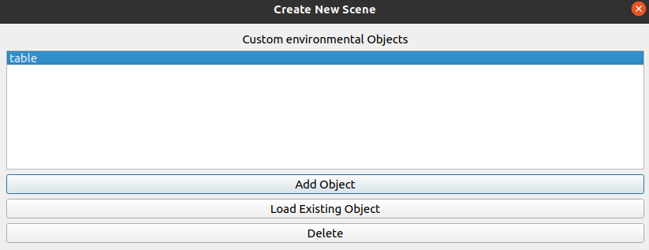

.. easy_manipulation_deployment documentation master file, created by
   sphinx-quickstart on Thu Oct 22 11:03:35 2020.
   You can adapt this file completely to your liking, but it should at least
   contain the root `toctree` directive.

.. _workcell_builder_example_load_object:

Loading an Object
--------------------

**This portion of the tutorial is to provide a guide on how to load the existing table object package that was previously generated by the workcell builder. If you have already created the table object in the same workcell builder session, skip this page and move on to:** :ref:`workcell_builder_example_extj`

In the main scene window, click on the load object button

Select the table object package and leave the name as "table". Click the OK button.

If the object is successfully loaded, your "Environment objects" field should be displayed as shown.

Next step: :ref:`workcell_builder_example_extj`

