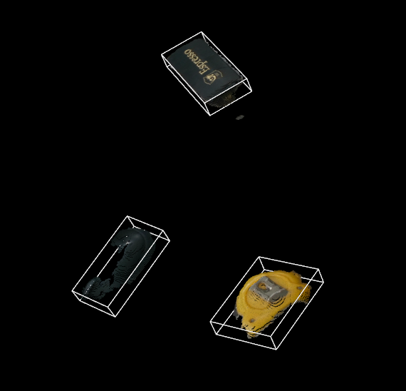

# pcl_ros2

ROS2 Package that uses PCL libraries to do basic point cloud manipulation.



Tested on ROS2 Foxy on Ubuntu Focal with PCL 1.11

## Installing PCL

```
git clone https://github.com/PointCloudLibrary/pcl
cd pcl && mkdir build && cd build
cmake -DCMAKE_BUILD_TYPE=Release ..
make -j2
sudo make -j2 install
```
## Package Details
This package subscribes to the `/camera/pointcloud` topic with the `sensor_msgs::msg::PointCloud2` message type.

## Running package
To run, build this package and run: 

`ros2 run pcl_ros2 pcl_test_node`
