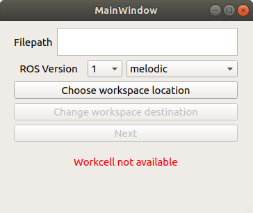
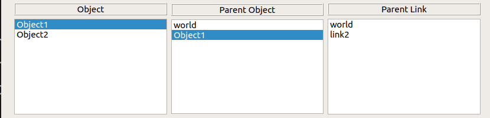
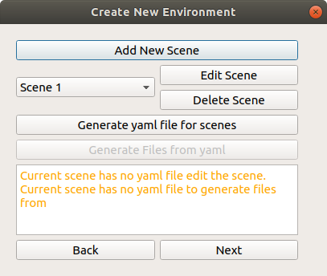

<!-- # Unsupervised Learning, depth based approach to generating 6 DOF grasp poses for novel objects -->

### This ROS package provides an easy to use Graphical User Interface for generation of a robotic workcell in RViz which serves as the first step in the pipeline for a pick and place task


__Example of a robotic workcell generated with this GUI__


## Contents

[Getting Started](#getting-started)
- [Running the package](#running-the-package)
   - [ROS 1 (Melodic)](#ros1-melodic)
   - [ROS 2 (Eloquent)](#ros2-eloquent)
- [Folder Structure](#folder-structure)
- [Uploading Relevant Assets](#uploading-relevant-assets)

[Creating a new scene](#creating-a-new-scene)
- [Adding a Robot into scene](#adding-a-robot-into-scene)
- [Adding an End Effector into scene](#adding-a-robot-into-scene)
- [Creating a New Environment Object](#creating-a-new-environment-object)
- [Linking all objects in scene](#connecting-objects-together)

[Generating YAML file](#generating-yaml-file)

[Generating other files ](#generating-other-files)

[Running the demo workcell](#running-the-demo-woirkcell)

[Loading Existing Scene](#loading-existing-scene)

[Editing the scene through the YAML file](#editing-the-scene-through-the-yaml-file)


---

# Getting Started

## Running the package

---
### ROS1 (Melodic)
Create a new Catkin Workspace and clone the repository into the source folder
```bash
source /opt/ros/melodic/setup.bash

mkdir catkin_ws && cd catkin_ws && mkdir src && cd src

git clone -b melodic-devel https://gitlab.com/gtan039/robotic-workcell-builder-qt.git

cd robotic-workcell-builder-qt

shopt -s dotglob; mv -- * ..

rm -rf robotic-workcell-builder-qt

cd ..

cd ..

catkin build

source devel/setup.bash

rosrun workcell_builder workcell_builder
```
---

[Back To Top](#contents)

### ROS2 (Eloquent)

Create a new colcon workspace and Clone the repository into the source folder.

```bash
source /opt/ros/eloquent/setup.bash

mkdir colcon_ws && cd colcon_ws && mkdir src && cd src

git clone -b eloquent-devel https://gitlab.com/gtan039/robotic-workcell-builder-qt.git

git clone -b eloquent https://github.com/ros-planning/moveit2.git

cd moveit2

git clone -b ros2 https://github.com/ros-planning/geometric_shapes.git

git clone -b ros2 https://github.com/ros-planning/random_numbers.git

git clone -b ros2 https://github.com/ros-planning/moveit_msgs.git

git clone -b ros2 https://github.com/wg-perception/object_recognition_msgs.git

git clone -b ros2 https://github.com/OctoMap/octomap_msgs.git

git clone -b ros2 https://github.com/ros-planning/srdfdom.git
```
Build and source the workspace and run the package to launch the GUI.

```bash
cd ..

colcon build

source install/setup.bash
 
ros2 run workcell_builder workcell_builder
```
---

if you receive the following error:

```
../libgeometric_shapes.so: undefined reference to `resource_retriever::Retriever::get(std::__cxx11::basic_string<char, std::char_traits<char>, std::allocator<char> > const&)'

```
add `find_package(resource_retriever)` to the `geometric_shapes` package

If there are no errors running the package either on ROS1 or ROS2 , you should see the main GUI window as seen below.

   

[Back To Top](#contents)

---
## Folder structure

It is (Highly) recommended to select the same workspace location as the workspace that you lodaded this package in.

From the main window, choose your workspace location. Ensure that the folder selected is the __main workspace folder__, i.e catkin_ws or colcon_ws


Once you see the confirmation message that the workcell is loaded, you can then check that folder using your file explorer and you will see the various folders required to store your assets created. Choose the ROS version and distribution required and click next to be directed to the scene select window

[Back To Top](#contents)

---
## Uploading Relevant Assets

Before generating a scene, you need to make sure you have the assets you need for the scene, especially for the robot and end effector. 

### __Robot__

For increased reusability and ease of visualization, we will create separate folders for separate vendors of Robots. For example, we will create a folder to store UR robots

```bash
cd workcell_ws/src/assets/robots

mkdir universal_robot
```
Copy over the moveit_config folder and description folders of the relevant robot models you want to add, ensuring that the folder names and file names follow the  [naming conventions](#naming-conventions)


### __End Effector__

Simlarly for End Effectors, we will create a separate folder for each End Effector Vendor. For example, we will create a folder to store Robotiq Grippers

```bash
cd workcell_ws/src/assets/end_effectors

mkdir robotiq
```
Copy over the moveit_config folder and description folders of the relevant end_effector models you want to add, ensuring that the folder names and file names follow the  [naming conventions](#naming-conventions)

### __Environment Objects__
For objects that is part of the environment that will be used as static collision objects, it should be stored in the workcell_ws/src/assets/environment folder. 

```
Current version of the GUI does not support loading of existing environment objects. For simple environment objects, consider creating a copy of the environment objects with the gui instead
```

[Back To Top](#contents)

---

## Creating a new Scene


If there are currently no scenes in the "scenes" folder, you need need to add a new scene. Click __Add New Scene__ .

You should be shown the window below, which is the start of scene creation. 


At this point, there are a few things you can do to populate the scene

1. [Adding a Robot into scene](#adding-a-robot-into-scene)
2. [Adding an End Effector into scene](#adding-a-robot-into-scene)
3. [Creating a New Environment Object](#creating-a-new-environment-object)
4. [Linking all objects in scene](#linking-all-objects-in-scene)

[Back To Top](#contents)

---

### __Adding a Robot into scene__

To add the robot into the workspace, check the __include robot__ box and the add robot button

__Current implementation of this GUI assumes that the Robot is connected to the World link__. Manual editing of the world link can be done through the URDF. 

If the error " No robot is detected in the workcell folder" is seen in the Robot Brand and Robot Model Fields, it means that the robot description folder and moveit_config is not properly loaded. Refer to [Uploading Relevant Assets](#uploading-relevant-assets)

Otherwise, you will see the window below


In the dropdown menu, select the robot brand and model you would like to include in the work space

#### __Origin__

The Origin is the positional and orientation coordinates values of the robot's __base link with respect to the World Link__. Unchecking the box defaults the XYZ and RPY coordinates to 0 

#### __Robot Base Link__

This is the link of the robot that will be connected to the World Link

#### __Robot End Effector Link__

This is the link of the robot that will be connected to the End Effector Base Link

[Back To Top](#contents)

---
### __Adding an End Effector into scene__

To add the end effector into the workspace, check the __include end effector__ box and the __add end effector__ button

```
Note that the end effector can only be included if the Robot is successfully loaded into the scene. 
```

If the error " No end effector is detected in the workcell folder" is seen in the End Effector Brand and End Effector Model Fields, it means that the end effector description folder and moveit_config folder is not properly loaded. Refer to [Uploading Relevant Assets](#uploading-relevant-assets)

Otherwise, you will see the window below


#### __Origin__

The Origin is the positional and orientation coordinates values of the __end effector's base link with respect to the Robot's end effector link__. Unchecking the box defaults the XYZ and RPY coordinates to 0 

#### __End Effector Link__

This is the link of the end effector (Usually the base link of the end effector) that will be connected to the Robot's End Effector Link (Usually the tip of the robot).

#### __End Effector Type__

Currently, the end effector types supported will be only for __2 Finger Grippers__ and __Single Suction Cup__. Thus the attribute options cannot be selected at this moment. 

[Back To Top](#contents)

---

### __Creating a new environment object__

[How to Create a New Object](./create_object.md)

[Back To Top](#contents)

---

### __Connecting objects together__

All Objects in the Scene is required to be connected to the world via an external joint. To assign an external joint to an object, double click on the object name to open up the external joint window

Note that if there are no valid objects to to be connected to in the scene, the only option will be to connect to the World object as seen below. 


Once the object is connected to the scene, you will see the parent object and link displayed against the object 



From the above picture, Object 1 is connected to the world via the world link while Object 2 is connected to Object 1 via the joint containing link2.

[Back To Top](#contents)

---
## Generating YAML File

For this ROS package, a YAML file will be used to be an easy to understand textual representation of the scene.



To generate this scene, click on the "Generate yaml for scene" button. An `environment.yaml` yaml file will be created in the src/scenes/<scene_name> folder


This will be the representation of your scene. For future minor changes in your scene, it is possible to do these changes via the YAML file directly rather than the GUI. __However, do note that errors may arise if you do not follow the proper YAML format.__

---

## Generating other files 

For the simulation to work, you need to also have additional files. This GUI automatically generates a few files required for simulation, namely: 


For ROS2: 
1. The Environment URDF that represents the entire scene
2. The launch file for simulation 
3. arm-hand SRDF file 

For ROS1:
1. The Environment Xacro that represents the entire scene
2. The launch file for simulation
3. The move_group.launch file 
4. The planning_context.launch
5. The arm-hand SRDF file

---
## Running the demo workcell

### ROS1

from the catkin workspace directory,

``` bash
catkin build
source devel/setup.bash
roslaunch <scene_name> demo.launch
```

### ROS2

from the colcon workspace directory,

``` bash
colcon build
source install/setup.bash
ros2 launch <scene_name> demo.launch.py
```

These launch files are a basic visualization of the scene, but can be expounded into incoporating perception based system to form a complete end ot end manipulation pipeline.

---

## Loading Existing Scene

To enable editing of the scene through the GUI, loading of existing scenes is possible through the YAML file. Ensure that the YAML file is located in the scenes/`<scene name>`/ folder

If the scene can be found, it will be available to be clicked to be edited.


---

## Naming Conventions

Following a standardized naming convention is highly recommended to avoid any issues with generating the workspace.


### __Description folder__

Any folder that provides a visual representation of each object in scene should be named ` <name>`_description
  
   ```
   The current exception to this rule is the description folder for universal robots, which is currently stored as a folder named  ur_description that encapsulates all the current robot models
   ```

If the folder contains URDF files for description, it should be in a __xacro__ format stored in the `urdf` folder, and named: 

- Robot

  `<robot_model>`.urdf.xacro
  
- End effector

  `<end_effector_model>`_gripper.urdf.xacro

- Environment objects

  `<object_name>`.urdf.xacro

### __moveit_config folder__