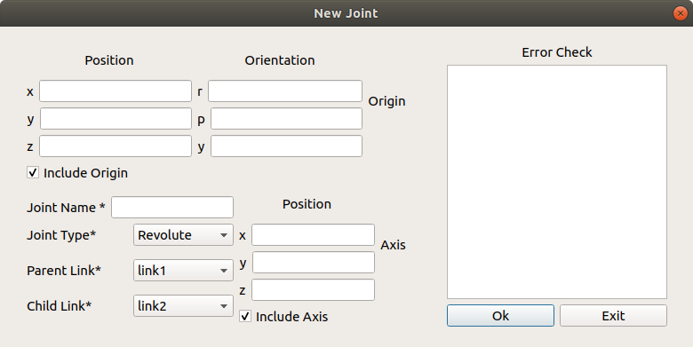

# Creating a New Environment Object

[Back to main README](./README.md)

An environment object can be used to create a visual representation of an object in a real robotic workcell, or additionally to act as a collision object to be taken into account during path planning


An object is required to have minimally one link that will be used to connect to the external world. This link will be selected under the `Object Child Link` Field. The type of joint you would want to connect to the world is also specifed in the field below

[Adding Links](#adding-links)

- [Adding Visual Components](#adding-visual-components)

- [Adding Inertial Components](#adding-inertial-components)

- [Adding Collision Components](#adding-collision-components)

[Adding Joints](#adding-joints)

[Origin Explanations](#origin-explanations)

## Adding Links

To find out more about each component, [Check out this link that described the various aspects of a link](http://wiki.ros.org/urdf/XML/link)

For an object, there should be at least one link that connects this object to the external world

---
### Adding Visual Component

The visual properties of the link. This element specifies the shape of the object (box, cylinder, etc.) for visualization purposes. Note: multiple instances of `visual` tags can exist for the same link. The union of the geometry they define forms the visual representation of the link. 

[Back to main README](./README.md)

[Back To Top](#creating-a-new-environment-object)

---

### Adding Inertial Component

This window allows you to add the inertial properties of the link. This aspect is __optional__ and will default to zero mass and zero inertia  if it is not specified.


__Inertia__

The 3x3 rotational inertia matrix, represented in the inertia frame. Because the rotational inertia matrix is symmetric, only 6 above-diagonal elements of this matrix are specified here, using the attributes ixx, ixy, ixz, iyy, iyz, izz.

__Origin__

Refer to [Origin Explanations](#origin-explanations)

__Mass__

Mass of the Link

[Back to main README](./README.md)

[Back To Top](#creating-a-new-environment-object)

---

### Adding Collision Component

This allows you to describe the collision properties of the link. __To reduce computation time, simpler collision models can be used to describe the object compared to the visual components__


[Back to main README](./README.md)

[Back To Top](#creating-a-new-environment-object)

---
## Adding Joints
To find out more about each component, [Check out this link that described the various aspects of a Joint](http://wiki.ros.org/urdf/XML/joint)

__Note that as of this current implementation, only simple joint attributes are included. Other attributes like calibration, dynamics, limits, mimic, safety_controller, will be added in future iterations__



### __Inheritance__

When creating a joint for two links in an object, note that it is not possible for a link to be a parent of another link that is higher on the inheritance hierarchy

```
For example,

Link A is a parent of Link B who is a parent of Link C
A > B > C

Link B is also a parent of Link D

B > D

By inheritance rules, Link D cannot be the parent of Link A (Because Link A is the parent of Link B)

```

__Axis__

Represents the joint axis specified in the joint frame. Note that this field is disabled for __fixed and floating joints__

[Back to main README](./README.md)

[Back To Top](#creating-a-new-environment-object)

---

## Origin Explanations

Note that there are many different origin sources for the Visual, Collision, Inertia and Joint aspects of the object. For each aspect of the link, all three (visual, collision and inertia) origins will be taken with respect to the zreference frame of the link__.

To find out where this reference frame is, we need to look at the __joint origin__ . The following example shows, generally, how the joint origin relates to the link origin. 


This configuration shows a `link` connected to the `base_link` with a joint origin of `0,0,0` and the visual mesh of `link` has an origin of `0,0,1`. As you can see, `link`'s tf is at the `0,0,0` of `base_link`, while the __visual__ component of `link` is at `0,0,1` from the __tf__ of `link`


In this configuration however, shows a joint origin of `0,0,1` and the visual mesh of `link` has an origin of `0,0,0`. As you can see, `link`'s __tf__ is at the `0,0,1` of `base_link`, while the __visual__ component of `link` is at `0,0,0` from the __tf__ of `link`
